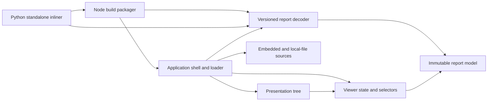
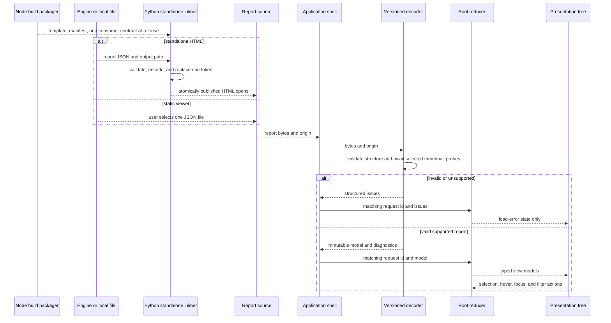

# ADR-0007: The viewer has one report model, explicit outcome components, and one offline build

- **Status:** Proposed
- **Date:** 2026-08-08
- **Extends:** ADR-0001. This record does not supersede it.
- **Release dependency:** [ADR-0008](0008-report-contract-for-viewer.md), which amends ADR-0002,
  must be **accepted** before this viewer can claim conformance with ADR-0001's three-closest-reference
  requirement. ADR-0008 requires exactly `min(3, references.length)` distinct exemplar entries per
  asset in closest-first order, each resolving to a supported, valid thumbnail. This record's exemplar
  guarantee tracks ADR-0008's rule exactly, including its board-with-fewer-than-three-references case;
  it does not independently require a fixed count of three.
- **Measurable claim:** no statistical claim. This record fixes architecture and exact rendering
  invariants. They are verified by deterministic regression tests, so it introduces no empirical
  quality threshold and owes no dataset row under `docs/adr/README.md:16-30`.

## Context

ADR-0001 fixes the boundary and leaves the inside of the viewer open. `moodboard` computes and
writes a report. `moodboard-view` is a TypeScript application built as static assets, reads that
report, and does not recompute scores, rankings, or intervals
(`docs/adr/0001-engine-and-viewer-split.md:28-47`). The same record makes simultaneous inspection
of the three closest reference images the reason a browser viewer exists
(`docs/adr/0001-engine-and-viewer-split.md:19-24`,
`docs/adr/0001-engine-and-viewer-split.md:49-56`). ADR-0006 keeps the product standalone and keeps
design-application SDKs outside the repository (`docs/adr/0006-standalone.md:26-51`). This record
preserves all three decisions.

The implemented report boundary already gives the viewer an inline thumbnail catalogue and gives
each asset exemplar identifiers that point into it
(`moodboard/schema/report_v1_0.schema.json:#/properties/references`,
`moodboard/schema/report_v1_0.schema.json:#/$defs/referenceEntry`,
`moodboard/schema/report_v1_0.schema.json:#/$defs/exemplar`). It also gives scored and abstained
assets different closed shapes, with `score`, `interval`, and `rank` absent from the abstained
shape (`moodboard/schema/report_v1_0.schema.json:#/$defs/scoredAsset`,
`moodboard/schema/report_v1_0.schema.json:#/$defs/abstainedAsset`). Ties arrive as explicit pairs
because the paired test is not transitive
(`moodboard/schema/report_v1_0.schema.json:#/$defs/comparisons/properties/ties`,
`docs/adr/0002-report-contract.md:143-150`). These distinctions have to survive presentation. A
component tree that passes raw JSON into every component can erase them as easily as an incorrect
report writer can.

Two gaps matter to this viewer without authorising it to change the report. First, neither asset
branch places a minimum or maximum on `exemplars`
(`moodboard/schema/report_v1_0.schema.json:#/$defs/scoredAsset/properties/exemplars`,
`moodboard/schema/report_v1_0.schema.json:#/$defs/abstainedAsset/properties/exemplars`). A v1.0
report can therefore supply fewer or more than the three images ADR-0001 expects. Second, a
candidate asset carries an identifier and a source string, but no candidate thumbnail or image
payload (`moodboard/schema/report_v1_0.schema.json:#/$defs/scoredAsset/properties/asset_id`,
`moodboard/schema/report_v1_0.schema.json:#/$defs/scoredAsset/properties/source`,
`moodboard/schema/report_v1_0.schema.json:#/$defs/abstainedAsset/properties/asset_id`,
`moodboard/schema/report_v1_0.schema.json:#/$defs/abstainedAsset/properties/source`). The viewer
cannot repair either gap by fetching, guessing, or copying an image.

Both gaps are addressed at the contract level by ADR-0008, which constrains exemplar cardinality and
ordering and adds an inline candidate thumbnail in report version 1.1
(`docs/adr/0008-report-contract-for-viewer.md:130-160`). That does not remove either gap from this
record's problem, because a version 1.0 report remains valid input forever. What it changes is that
the viewer now has two card presentations to specify and test rather than one, and the version 1.0
presentation is a permanent legacy path rather than a placeholder waiting on a schema decision.

The engine validates a report against JSON Schema and the cross-field axis invariant immediately
before it writes the file (`moodboard/report.py:759-782`). A viewer must still treat a file handed
to it as untrusted input. The browser may receive a report from another producer, an older release,
or an edited attachment. The `moodboard report --html` entry point is named but currently raises
`NotImplementedError` (`moodboard/cli.py:1029-1042`, `moodboard/cli.py:1151-1161`), so that entry
point has no implemented path whose internal structure this record has to preserve.

## Decision

### Boundary relationship to ADR-0001

The viewer is a client-side React application written in strict TypeScript and built with Vite.
React function components own rendering, one reducer owns cross-component state, and framework-free
modules own report loading, decoding, validation, and indexing. Vite is a build-time tool. React and
the decoder are bundled into the static assets, and neither Node nor a package registry is needed to
open a distributed report.

The Python command performs deterministic packaging only. It validates report bytes, encodes them,
and inserts them into a built viewer shell. It does not create display values or render a score.
Once the file opens, the TypeScript viewer performs all presentation. This preserves the division in
ADR-0001 and adds no computation path.

**Relationship among the existing records.** All six of ADR-0001 through ADR-0006 carry status
`Proposed` (`docs/adr/README.md:37-45`), so nothing below rests on their having been accepted.
The v1.0 schema is closed and fixes
`schema_version` to `1.0` (`moodboard/schema/report_v1_0.schema.json:#`,
`moodboard/schema/report_v1_0.schema.json:#/properties/schema_version`). ADR-0002 originally required a
v1 consumer to ignore fields added by any later v1 minor version
(`docs/adr/0002-report-contract.md:209-213`). [ADR-0008](0008-report-contract-for-viewer.md) amends
ADR-0002, replacing that blanket rule with a directional one: a consumer tolerates only the minor
versions its own contract explicitly names as supported, and refuses every other minor exactly as it
refuses an unsupported major
(`docs/adr/0008-report-contract-for-viewer.md:289-308`). This record's decoder follows ADR-0008's rule,
not ADR-0002's original one — see "Report loading and version handling" below for the exact
consequence. The closed schema therefore governs v1.0 writers, while the named-minor compatibility rule
governs readers of every other supported minor. The current unconstrained exemplar array cannot prove
that a report contains `min(3, references.length)` distinct, resolvable closest references in
closest-first order. Legacy v1.0 reports receive visible compatibility diagnostics. ADR-0008 must add
the missing producer guarantee before release. Remote report URLs, servers, report editing, and model
execution remain outside v1 because ADR-0001 fixes a local report file and static viewer boundary
(`docs/adr/0001-engine-and-viewer-split.md:28-47`).

This record cannot advance from `Proposed` until ADR-0008 is accepted and names the first schema
version carrying the guarantee — ADR-0008 proposes that version as `1.1`, but this record does not
treat that proposal as binding until ADR-0008 itself is accepted. Acceptance of this record does not
itself modify the report schema.

No version number is selected here because that would silently decide ADR-0008's outcome ahead of its
own acceptance. Until ADR-0008 is accepted and records an exact version, `strict_triptych_since` in
the consumer contract is null, `1.1` (or any minor beyond `1.0`) is absent from
`supported_minor_versions`, and verification exits with `dependency-unresolved`. No viewer release
is produced in that state.

### Components and dependency direction

There are eight components. Each arrow means that the source component imports or consumes a
contract owned by the target component. The arrows below are the complete allowed dependency graph.
A source adapter never imports React. A presenter never receives raw JSON. The reducer never parses
or validates a report. Neither packager imports a presentation component's internal state.



Counting these eight components and eleven directed dependencies gives
`kappa = 11 / (8 * 7) = 0.196`. This describes the proposed graph and establishes no quality threshold.
Adding a dependency requires updating the diagram and the arithmetic in the same change, which makes
coupling growth visible without inventing a pass boundary after implementation.

The dependency test assigns every viewer and Python inliner source file to one of these eight owners,
collapses imports and packaged-contract reads to unique owner-to-owner edges, and compares that set
with the diagram. This includes the inliner's reads of Node-built package data and the consumer
contract. Imports within one owner are not graph edges. Browser, Node, and Python standard APIs are
external platform dependencies and are not counted as repository components.

**Node build packager.** This component runs during development and release. It builds the browser
application, resolves the Vite asset graph, writes the static distribution, and writes a report-free
standalone HTML template plus a language-neutral artifact manifest and consumer contract. Its output
is bytes plus SHA-256 hashes. It has no report data and no UI state.

**Python standalone inliner.** This component implements the public command
`moodboard report REPORT_JSON --html OUTPUT_HTML`, whose arguments are already reserved by the CLI
(`moodboard/cli.py:1029-1047`, `moodboard/cli.py:1151-1160`). It consumes the packaged template,
artifact manifest, and consumer contract. It applies the same version and integrity policy as the
browser decoder, inserts one encoded report payload, and publishes the result atomically. It never
imports Node or presentation code.

**Application shell and loader.** This component selects exactly one source, asks the decoder for a
model, creates the reducer state, and mounts the presentation tree. It is the only component that
coordinates those calls. A failure leaves it in a load-error state and never mounts a partial report.

**Embedded and local-file sources.** A source returns raw report bytes and an origin label. The
embedded source reads the base64 payload in a standalone HTML document. The local-file source reads
one user-selected `.json` file with the browser File API. Neither source parses JSON, calls `fetch`,
or follows the report's `source` strings.

**Versioned report decoder.** This component parses bytes from `unknown`, selects the major-version
decoder, validates known fields and cross-field invariants, and returns either a model or structured
issues carrying JSON paths. It is the only TypeScript component allowed to inspect untyped report
values. Its checked-in, language-neutral consumer contract defines the known v1 projection and the
cross-field rules used by both the browser decoder and Python inliner. In the browser it also awaits
an injected thumbnail probe for every distinct triptych-selected reference that resolves, and, when
the report is version 1.1, for each asset's own candidate thumbnail. Every probe that succeeds
produces a branded `SafeThumbnailSource` before the immutable model is returned.

**Immutable report model.** This component contains the known v1 report projection, a unique
`reference_id` index, asset index, the original ordered tie pairs, and non-fatal integrity
diagnostics, including immutable thumbnail availability for candidate and reference imagery alike. The indexes make lookup cheap but do not
derive a score, interval, rank, tie, exemplar, or axis value. The report and indexes are read-only
after construction.

**Viewer state and selectors.** This component defines the reducer state, transitions, and every
selector used across presentation components. The application shell owns the one reducer instance.
Pure selectors turn the model and UI state into typed view models. A selector may filter, look up, or
order by a report-provided rank. It may not calculate a rank, tie, score, interval, threshold, or
combined axis value.

**Presentation tree.** This component receives typed view models and dispatch callbacks. It contains
the report header, diagnostics, score overview, one global tie list, asset collection, candidate
preview, reference triptych, scored outcome, abstained outcome, axis table, board details, and
provenance details. Adding the candidate preview grows this component's internal tree and adds no
graph edge, so the eight owners and eleven dependencies above are unchanged and `kappa` still
reads `0.196`. A new presenter file belongs to the presentation-tree owner like any other.
Components insert free-text report fields only as text nodes. The decoder may construct a branded
thumbnail `data:` source from a validated allowlisted MIME and base64 payload; no other report string
may become a URL, HTML, CSS, or executable code. Use of `dangerouslySetInnerHTML` is forbidden.

```text
ViewerApp
|-- AwaitingFileView
|-- LoadingView
|-- LoadErrorView
`-- ReportView
    |-- ReportHeader
    |-- ReportDiagnostics
    |-- ScoreOverview
    |-- TieList
    |-- AssetCollection
    |   `-- AssetCard
    |       |-- CandidatePreview
    |       |-- ReferenceTriptych
    |       |-- ScoredOutcome | AbstainedOutcome
    |       `-- AxisTable
    |-- BoardDetails
    `-- ProvenanceDetails
```

The graph is deliberately small enough to test without a browser at four boundaries. Source adapters
accept byte fixtures. The decoder accepts `unknown`. Reducer transitions and selectors are pure.
Presenters accept typed props. Browser tests are reserved for integration among those seams and for
layout behavior that a DOM-only test cannot establish.

The presentation tree has an explicit route for every known v1 field. A route is visible text or
image data, or a validation-only model field with a stated reason. `ReportHeader` owns the origin
label, schema version, board name, and board identifier. `BoardDetails` owns the remaining board,
representation, fit, category, board-statistics, and complete reference-catalogue metadata.
`ProvenanceDetails` owns every provenance field. `AssetCard` owns identity, source, category, local
sample size when present, flags, axes, outcome fields, and exemplars. Its `CandidatePreview` renders
the version 1.1 candidate thumbnail and prints the candidate's original content hash, MIME, and
dimensions beside it, because those identify the bytes the engine actually scored and the preview
does not (`docs/adr/0008-report-contract-for-viewer.md:386`). `TieList` owns the report's
comparison note and exact pair list. Each selected `ReferenceCell` renders the thumbnail and repeats
the catalogue entry's content hash, original MIME and dimensions, thumbnail MIME and dimensions,
exemplar position, identifier, and similarity. A thumbnail's base64 field is image data when selected
and remains validation-only model data when no exemplar selects it; it is never printed. Details may
begin in a local disclosure, but the triptych, statistical outcome, abstention explanation, and
diagnostics are always visible.

### Typed contracts and state ownership

The module-boundary contracts have this shape. Exact report field types are generated from the
committed schema, which avoids a second hand-maintained interface.

```ts
type ReportOrigin =
  | { readonly kind: "embedded"; readonly label: string }
  | { readonly kind: "local-file"; readonly label: string };

type ReportIssueCode =
  | "source-read"
  | "utf8"
  | "json-syntax"
  | "version"
  | "schema"
  | "cross-field"
  | "numeric-range"
  | "thumbnail-probe"
  | "integrity";

interface ReportIssue {
  readonly severity: "fatal" | "diagnostic";
  readonly code: ReportIssueCode;
  readonly path: string;
  readonly message: string;
}

type ReportReadResult =
  | { readonly ok: true; readonly bytes: Uint8Array }
  | {
      readonly ok: false;
      readonly issue: ReportIssue & {
        readonly severity: "fatal";
        readonly code: "source-read";
      };
    };

interface ReportSource {
  readonly origin: ReportOrigin;
  read(): Promise<ReportReadResult>;
}

type DecodeResult =
  | { readonly ok: true; readonly model: ReportModel }
  | { readonly ok: false; readonly issues: readonly ReportIssue[] };

type StructuralDecodeResult =
  | {
      readonly ok: true;
      readonly projection: ValidatedReportProjection;
      readonly diagnostics: readonly ReportIssue[];
    }
  | { readonly ok: false; readonly issues: readonly ReportIssue[] };

interface ReportDecoder {
  validateStructure(bytes: Uint8Array): StructuralDecodeResult;
  decode(bytes: Uint8Array, origin: ReportOrigin): Promise<DecodeResult>;
}

declare const safeThumbnailSource: unique symbol;
type SafeThumbnailSource = string & { readonly [safeThumbnailSource]: true };

interface ThumbnailProbe {
  decode(source: SafeThumbnailSource): Promise<"decoded" | "undecodable">;
}

type ViewerState =
  | { readonly phase: "awaiting-file" }
  | {
      readonly phase: "loading";
      readonly origin: ReportOrigin;
      readonly requestId: number;
    }
  | {
      readonly phase: "failed";
      readonly origin: ReportOrigin | null;
      readonly issues: readonly ReportIssue[];
    }
  | {
      readonly phase: "ready";
      readonly origin: ReportOrigin;
      readonly model: ReportModel;
      readonly selectedAssetId: string | null;
      readonly hoveredAssetId: string | null;
      readonly focusedAssetId: string | null;
      readonly outcomeFilter: "all" | "scored" | "abstained";
    };
```

No source error crosses the adapter as an untyped exception. Source paths use `$source`, UTF-8 and
JSON-syntax errors use `$bytes`, and parsed-document issues use JSON Pointer. A failed `DecodeResult`
contains only fatal issues. Non-fatal integrity issues are stored as diagnostics on `ReportModel` and
are always presented by `ReportDiagnostics`.

`decode` calls `validateStructure` once and then performs browser thumbnail preflight. The Python
inliner exposes the same package-private structural result for parity tests before it packages HTML.
Those results are serializable as acceptance plus ordered fatal or diagnostic issue code and path;
browser-only probe issues are appended in a separate phase.

Structural issue lists sort by the UTF-8 bytes of JSON Pointer, then by severity with fatal first,
then by issue code, and duplicate severity-code-path triples collapse. Library-specific error prose
does not participate in parity. User-facing messages for the fixed viewer rules are owned by the
versioned decoder rule table and tested separately as visible text.

The application shell owns one `ViewerState` reducer instance. Loading a second local file atomically
leaves `ready`, removes the old model from rendered state, and resets selection, hover, focus, and
filtering before the new read begins. A successful load publishes only the new model. A failed load
shows only the new origin and its issues; it does not restore or partially render the old report.
Reports are never merged.
`selectedAssetId` records a deliberate click or keyboard selection. `hoveredAssetId` and
`focusedAssetId` record transient pointer and keyboard locations separately. The `activeAssetId`
selector returns the hovered identifier, then the focused identifier, then the selected identifier.
Pointer leave clears only hover, and blur clears only focus. This rule restores the focused asset when
the pointer leaves another asset. `outcomeFilter` controls visibility only. It never changes ranks or
tie pairs.

The shell assigns a monotonically increasing `requestId` to each load. A source read, structural
decode, or thumbnail preflight result can transition state only while its identifier matches the
current loading state. Starting report B therefore invalidates every pending completion from report A.
The viewer never publishes a preliminary model and then mutates its diagnostics after `ready`.

A component may keep disclosure state locally when opening it cannot affect another component. The
board-details and provenance-details disclosure controls are examples. Derived data is never copied
into state. Reference lookups, tie adjacency, the visible asset list, and the three exemplar slots
are selectors over the immutable model. V1 writes no report or UI state to local storage, cookies, a
URL, or a remote service.

A `ReferenceCell` may also keep a local render-failure flag. If its `` emits an error after the
same source passed preflight, that cell replaces the image with the visible and accessible text
"Thumbnail passed preflight but could not be rendered." This late platform failure does not revise
the immutable report model or its integrity diagnostics and cannot hide the reference identifier,
position label, or similarity.

The decoder preserves the report's discriminated union. Presenters switch on `asset.state` before
they receive outcome-specific props. A scored outcome type requires `score`, `interval`, and `rank`.
An abstained outcome type has none of those members and requires `reason`, `explanation`, and
`measurement`. TypeScript exhaustiveness checks make a new report state a compile failure until a
presenter handles it.

### Report loading and version handling

The static distribution opens to a local-file picker. Selecting a file reads it in memory and makes
one asynchronous decoder call. Drag-and-drop may invoke the same adapter, but it is not a separate
load path. The loading state remains visible while structural validation and thumbnail preflight run.
`LoadingView` displays the origin label and "Validating report and reference images" with no report
values. A local-file failure leaves the picker available and displays the origin label plus decoder
issues. After a successful local-file load, `ReportHeader` retains an "Open another report" control
that enters the same adapter. No board, asset, score, or thumbnail is rendered from a failed decode.

The standalone distribution contains exactly this non-executable payload element:

```html
<script type="application/octet-stream" id="moodboard-report">__MOODBOARD_REPORT_BASE64__</script>
```

The token appears exactly once in the report-free template. The Python inliner base64-encodes the
UTF-8 report bytes, so a report string containing an HTML closing tag cannot terminate the element.
It verifies the manifest, template, token count, and report before writing a sibling temporary file
and atomically replacing the requested destination. A failure preserves any existing destination and
leaves no published partial file. The standalone shell has no file picker because its embedded report
is the artifact's identity. An embedded load failure therefore presents only the origin and issues.

Both consumers decode UTF-8 strictly before JSON parsing. TypeScript uses a fatal UTF-8 decoder and
Python uses strict decoding; neither replaces malformed bytes with U+FFFD. The TypeScript JSON parser
preserves numeric lexemes until validation. Before converting a token, both consumers require its
exact decimal value to equal the exact decimal value of the shortest representation of the resulting
finite binary64 number. A token such as `0.100000000000000005` or `1e10000` is therefore a fatal
`numeric-range` issue instead of silently rounding or overflowing. Any integer-valued JSON token whose
absolute value exceeds `9007199254740991`, at any path including an open measurement map, is also a
fatal `numeric-range` issue in both consumers. The current schema leaves integer fields such as rank,
`n_local`, and image dimensions without a matching upper bound
(`moodboard/schema/report_v1_0.schema.json:#/$defs/scoredAsset/properties/rank`,
`moodboard/schema/report_v1_0.schema.json:#/$defs/scoredAsset/properties/n_local`,
`moodboard/schema/report_v1_0.schema.json:#/$defs/referenceEntry/properties/width`). The bound is the
largest integer ECMAScript represents exactly. The round-trip rule preserves the numeric values
written by the current engine's primitive-number serializer (`moodboard/report.py:335-385`) while
refusing edited JSON that the viewer would otherwise display as a different value. Both boundaries
were fixed before testing and are not empirical quality thresholds.

The TypeScript decoder uses `lossless-json` `4.3.1` to retain numeric tokens, applies the shared
safe-integer walk, converts accepted values to native numbers, and then validates with Ajv `8.20.0` in
Draft 2020-12 mode. Ajv treats `format` as an annotation so it matches the Python writer's existing
`jsonschema.validate` call without a format checker (`moodboard/report.py:759-771`); explicit schema
patterns still run. The Python structural consumer uses `jsonschema` `4.26.0` and applies the same
safe-integer walk before schema validation.

The decoder handles versions in this order:

1. It parses `schema_version` before it reads any report payload field. A malformed version is a
   fatal load issue.
2. It refuses every unsupported major version, rendering the supported and received majors in the
   error view. Within a supported major it also refuses every minor absent from
   `supported_minor_versions` — including a minor numerically later than every named one — rendering
   the supported and received minors in the same error view. This is
   [ADR-0008](0008-report-contract-for-viewer.md)'s directional, named-minor compatibility rule
   (`docs/adr/0008-report-contract-for-viewer.md:289-308`), which replaced ADR-0002's blanket
   ignore-unknown-minor rule; a decoder that instead tolerated every `1.x` would revive the replaced
   policy and contradict ADR-0008's compatibility matrix. `supported_minor_versions` is `["1.0"]` until
   ADR-0008 is accepted and adds `"1.1"`.
3. It validates a `1.0` document against the exact closed v1.0 writer schema and the viewer's
   cross-field checks.
4. For a document whose minor is named in `supported_minor_versions` and is later than `1.0`, it
   recursively projects known fields at every object level and records the complete JSON path of
   every ignored field. A validation-only copy receives `schema_version: "1.0"` and is checked against
   the exact closed v1.0 schema. The model retains the received minor version for display. The decoder
   never rewrites the input bytes or claims that the later document is a v1.0 writer document. Known
   branch fields keep their v1 meaning. A `score`, `interval`, or `rank` on an abstained asset is
   therefore fatal even when the later minor contains other additive fields. This step never runs for
   a minor rejected by step 2.

The consumer contract distinguishes closed records from open maps. Projection removes unknown named
properties only from records whose v1 shape is closed. It retains entries permitted by open maps,
including report-declared axis and measurement keys, and validates each retained value against that
map's v1 value schema. Arrays preserve order and apply the same rule to every item. This prevents an
additive structural field from bypassing the v1 model while preserving dynamic axis and measurement
data permitted by the open v1 maps (`moodboard/schema/report_v1_0.schema.json:#/$defs/axesScored`,
`moodboard/schema/report_v1_0.schema.json:#/$defs/axesAbstained`,
`moodboard/schema/report_v1_0.schema.json:#/$defs/abstainedAsset/properties/measurement`).

The normative `viewer/known-v1-projection.schema.json` closes the format of
`known-v1-projection.json` and generates its TypeScript and Python types. Its logical shape is:

```ts
type ProjectionNode =
  | {
      readonly kind: "closed-record";
      readonly schema_pointer: string;
      readonly fields: Readonly<Record<string, ProjectionNode>>;
    }
  | { readonly kind: "open-map"; readonly values: ProjectionNode }
  | { readonly kind: "array"; readonly preserve_order: true; readonly items: ProjectionNode }
  | {
      readonly kind: "discriminated-union";
      readonly discriminator: string;
      readonly variants: Readonly<Record<string, ProjectionNode>>;
    }
  | { readonly kind: "scalar"; readonly schema_pointer: string }
  | { readonly kind: "any-json" };

interface KnownV1ProjectionContract {
  readonly format_version: 1;
  readonly writer_schema_version: "1.0";
  readonly supported_minor_versions: readonly string[];
  readonly utf8_policy: "fatal-no-replacement";
  readonly maximum_safe_integer: 9007199254740991;
  readonly thumbnail_mime_allowlist: readonly ["image/png", "image/jpeg", "image/webp"];
  readonly strict_triptych_since: string | null;
  readonly projection: ProjectionNode;
  readonly structural_rules: readonly [
    "unique-asset-id",
    "unique-reference-id",
    "unique-exemplar-id-per-asset",
    "interval-order",
    "score-style-equality",
    "axis-vocabulary-equality",
    "tie-distinct-scored-endpoints",
    "tie-unique-unordered-pair",
    "binary64-roundtrip",
    "safe-json-integer",
    "legacy-exemplar-diagnostic",
    "strict-triptych-evidence",
  ];
}
```

Every schema pointer must resolve in the packaged v1.0 writer schema. The committed projection tree
must cover every writer-schema field exactly once, and generated types in both languages must match
the contract schema. `supported_minor_versions` always contains `"1.0"`; every other entry must be a
minor accepted by a superseding report-contract record. `strict_triptych_since` is either null or a
member of `supported_minor_versions`; when non-null it must equal the exact version named by the
accepted report-contract ADR. Both consumers refuse to initialize if any of these checks fails.

The `any-json` node is used only where the v1.0 writer schema leaves a value unconstrained. It retains
the complete JSON subtree, including object keys and array order, while the shared safe-integer rule
still walks every numeric token. In v1.0 that node is required for abstention measurement values
(`moodboard/schema/report_v1_0.schema.json:#/$defs/abstainedAsset/properties/measurement`).

A non-null `strict_triptych_since` applies to that version and every later accepted v1 minor. The
consumers compare canonical minor-version digit strings first by length and then lexicographically.
They do not convert the minor to a JavaScript number, so a syntactically valid large minor cannot
wrap, round, or evade the strict rule.

The Python inliner applies the same major-version selection, recursive known-field projection, and
structural cross-field rules from the packaged consumer contract before it embeds a report. The
browser repeats those checks when the HTML opens. For a strict-triptych report, Python verifies each
selected thumbnail with the pinned Pillow decoder and the running browser verifies it with its native
image decoder. Either rejection is fatal in its own loading path. Release fixtures must pass the
pinned Chromium, Firefox, and WebKit decoders. For legacy v1.0, both structural
consumers record invalid base64 or unsupported MIME as diagnostics, and Python leaves actual
presentation decodability to the browser as a further diagnostic. The shared contract and parity
fixtures prevent the two structural implementations from choosing different rules.

The viewer adds cross-field checks where a misleading partial rendering is worse than refusal. Fatal
issues are duplicate asset identifiers, duplicate reference identifiers, duplicate exemplar
identifiers within one asset, an interval whose low endpoint exceeds its high endpoint, a scored
asset whose `score` differs from `axes.style`, a tie whose endpoints are equal, a tie that names an
abstained or absent asset, and a repeated unordered tie pair such as both A-B and B-A. The axis-key
equality enforced by the writer remains fatal to the reader
(`moodboard/report.py:723-771`). A tie list that passes these checks is rendered once at report scope.

An unresolved exemplar identifier, invalid thumbnail base64, an unsupported thumbnail MIME, or a
legacy v1.0 exemplar count other than three is a non-fatal structural integrity diagnostic. On legacy
input, the browser thumbnail probe also creates a non-fatal diagnostic for valid base64 bytes that its
image decoder rejects. It constructs an unmounted image from each branded `data:` source and awaits
`HTMLImageElement.decode()`. Unresolved identifiers, invalid base64, and unsupported MIME values never
enter the probe. The decoder waits for all probes to settle before `ready`, stores their availability
and diagnostics in the model, and uses a labelled empty slot for a rejected legacy image. The v1
thumbnail MIME allowlist is exactly `image/png`, `image/jpeg`, and `image/webp`; other values remain
report data but are not decoded into a browser image. The viewer never substitutes another reference
or follows a URI to fill the slot.

A failure to initialize or execute the probe mechanism is a fatal `thumbnail-probe` issue because the
viewer cannot establish its image state. Rejection of one specific image is a non-fatal `integrity`
diagnostic for legacy v1.0 and a fatal `integrity` issue for a strict-triptych report.

For a report version that declares the release contract required by this record, an exemplar count
other than three, an unresolved identifier, a duplicate identifier, or an increase in similarity from
one serialized exemplar to the next is fatal. An unsupported thumbnail MIME, invalid base64, image
payload rejected by the Python decoder during inlining, or image payload rejected by the browser probe
is also fatal for that version. This distinction allows honest inspection of legacy v1.0 while
enforcing three displayable closest references when a report claims the strict guarantee.

The consumer contract records the exact first schema version covered by that guarantee after the
report-contract decision is accepted. Until then the field is null and the release dependency is
unresolved. The decoder selects the strict rule by the received version; it never infers the guarantee
from an array that happens to contain three entries.



### All three reference images stay visible together

Every asset card reserves a `ReferenceTriptych` of up to three cells directly beside its outcome. In
the release contract, every asset has exactly `min(3, references.length)` distinct exemplar
identifiers, each resolves to the inline reference catalogue, and their serialized order is closest
first by the producer's reported similarity. On an ordinary board of three or more references this is
three cells; on a board with fewer than three references — [ADR-0008](0008-report-contract-for-viewer.md)
identifies a small abstention report as the case this arises for — the triptych renders exactly that
many cells and no more, and never invents a placeholder cell to reach three. The viewer preserves this
order and never decides which references are closest. ADR-0008 owns these guarantees and is a release
dependency of this record. The viewer may be implemented against legacy v1.0 reports before ADR-0008 is
accepted, but it cannot be called ADR-0001-conforming until the producer guarantee exists and its
fixtures pass.

The three cells are visible before hover, focus, or expansion. The component does not use a carousel,
tabs, pagination, or an initial single-image state. At narrow widths the cells become smaller but
remain one three-column comparison strip. Essential captions remain visible, and horizontal scrolling
is not used to hide one of the three cells. The layout regression uses viewports of 320 by 800 pixels
and 1280 by 800 pixels. The 320-pixel case was fixed before implementation because three 96-pixel
cells, two 8-pixel gaps, and two 8-pixel outer margins exactly occupy that width. These serve only as
structural test inputs and establish no measured quality cutoff.

Each resolved cell uses the inline thumbnail from the reference catalogue and labels its ordinal,
using the words "First," "Second," or "Third," plus its `reference_id` and reported similarity. It
does not call the original reference MIME or dimensions a display image, because the v1.0 report
contains only the thumbnail bytes at that boundary
(`moodboard/schema/report_v1_0.schema.json:#/$defs/referenceEntry/properties/thumbnail`). Hover may
highlight a reference elsewhere, but it cannot reveal information that is otherwise hidden. Keyboard
focus produces the same highlight as pointer hover.

The schema gap remains visible for legacy v1.0 input. When an asset supplies fewer than three
exemplars, the remaining cells say that the report did not supply that exemplar slot. When an
identifier does not resolve or its thumbnail cannot decode, its cell names that integrity failure.
When an asset supplies more than three exemplars, the triptych uses the first three and a diagnostic
states that the report supplied additional entries that were not presented. Legacy slots are labelled
"reported exemplar" because v1.0 does not guarantee closest-first order or a count of three. The UI
never calls these legacy slots the three closest references. It never repeats an image, sorts by
similarity, or fetches a replacement. Duplicate exemplar identifiers are fatal because a repeated
image would defeat the simultaneous comparison.

Whether the card shows the candidate itself depends on the report version. The report-contract
decision this paragraph used to be waiting on is now written down as ADR-0008, which is `Proposed`
and lands with this record rather than ahead of it. Report version 1.1 carries an
inline candidate thumbnail as base64 image data
(`docs/adr/0008-report-contract-for-viewer.md:130-160`), so a v1.1 card renders that image beside the
triptych under the same rules the reference cells obey: a declared MIME on the allowlist, declared
dimensions the bytes actually produce, and a branded `SafeThumbnailSource` built by the decoder. A
candidate thumbnail failing any of those checks becomes an inert placeholder naming the failure, in
the same way an undecodable reference cell does. This is what turns the card into a comparison
instead of a label, because the thing being judged and the references it was judged against are then
visible at the same time, which is what ADR-0001 asks for.

Report version 1.0 carries no candidate image bytes at all
(`moodboard/schema/report_v1_0.schema.json:#/$defs/scoredAsset`,
`moodboard/schema/report_v1_0.schema.json:#/$defs/abstainedAsset`). A legacy card therefore shows the
candidate's `asset_id` and `source` as text and states that report version 1.0 did not carry a
candidate preview, so the absence reads as a known limit of the input rather than as a missing
image. Neither version treats `source` as a fetchable URL, so the offline boundary holds whether or
not a preview is present.

### Intervals, ties, and abstentions have different visual grammar

The score overview and every scored asset card use a fixed zero-to-one horizontal scale, matching the
implemented score and interval bounds (`moodboard/schema/report_v1_0.schema.json:#/$defs/pValue`,
`moodboard/schema/report_v1_0.schema.json:#/$defs/interval`). The interval is the dominant mark, with
both endpoints printed beside it. The reported conformal p-value is a labelled marker on the same
scale, never a standalone dial, star rating, progress ring, or filled bar. Adjacent text reads, for
example, "Reported inlier p-value 0.31. Stated level 0.9 interval 0.18 to 0.42. Method:
loo-jackknife-plus." The score stays a decimal. The viewer never turns `0.31` into "31% on brand",
"31% likely to pass", or another probability claim. ADR-0003 defines the narrower meaning and
forbids that interpretation (`docs/adr/0003-style-representation.md:97-121`).

The score overview gives every scored asset one interval row on that shared scale. Hover, focus, or
selection applies redundant outline, weight, and text emphasis to the same asset's overview row and
card, including its triptych and outcome heading. No value or layout position changes. An abstained
asset has no overview row, so its active emphasis remains on the unranked card and never creates a
numeric position.

The interval level and method are visible text. A tooltip is never their sole carrier. Color is
redundant with endpoint position, line style, and text. The accessible name states the point value,
both endpoints, the level, and the method. If the interval is `[0, 1]`, the full width remains visible
and the text says so. The viewer does not narrow the scale to make a result look more precise. If the
endpoints are equal, the band becomes a visible endpoint rule and the text explicitly names a
zero-width interval. The band does not disappear behind the point marker.

The viewer formats the score, endpoints, and raw interval level with ECMAScript `String(number)`, the
shortest decimal representation that round-trips to the parsed number. It does not apply fixed decimal
places that could collapse distinct endpoints and does not derive a percentage. Thus endpoints
`0.1000001` and `0.1000002` remain visibly distinct. This is an exact serialization rule and has no
numeric tolerance.

The score overview orders scored assets by the report-provided rank and uses `asset_id` only for stable
presentation among equal ranks. It omits abstained assets from that ranked graphic because the report
omits their rank. The report owns the rule that larger scores rank first and abstained assets carry no
rank; the viewer performs no calculation (`docs/adr/0002-report-contract.md:152-159`).

Ties are rendered only from `comparisons.ties` in one report-level `TieList`. Each accepted unordered
pair appears exactly once as a sentence naming the two assets and the paired comparison rule. The
viewer does not infer a tie from marginal interval overlap, and it does not compute a transitive
closure. If the report contains pairs A-B and B-C, the UI shows two relations and does not manufacture
an A-B-C tie group. This preserves the engine-owned rule in ADR-0002
(`docs/adr/0002-report-contract.md:143-150`).

An abstained asset uses an `AbstainedOutcome` component whose heading is "No style score was issued."
It displays the reason label, the report's complete explanation, and every trigger-measurement value.
The current measurement shape is an open object whose property values are unconstrained JSON
(`moodboard/schema/report_v1_0.schema.json:#/$defs/abstainedAsset/properties/measurement`). The
`MeasurementTree` selector therefore walks it in iterative depth-first order and emits a flat
definition list. Object keys use JSON Pointer escaping and ECMAScript `sort()` order; array indices
retain source order; strings are JSON-quoted; numbers use `String(number)`; booleans and null use the
literals `true`, `false`, and `null`; and empty nested containers use `{}` or `[]`. Each leaf's
complete path is its term. No object or array is coerced to a string.

The abstained outcome has no score marker, interval band, rank position, zero placeholder, faded
gauge, or empty numeric cell. The classical axis values remain in a separately labelled axis table,
with `style` shown as unavailable, because the report deliberately keeps those values on the
abstained branch (`docs/adr/0002-report-contract.md:189-202`). A classical axis may also be null under
the current abstained-axis schema
(`moodboard/schema/report_v1_0.schema.json:#/$defs/axesAbstained/additionalProperties`). Every null
axis is rendered as "Unavailable" beside its axis name and is never shown as zero or an empty cell.
Abstained assets appear in an unranked section before filtering and can never be sorted to the bottom
of the scored ranking.

Palette, tone, composition, and any later report-declared classical axes remain separate. The UI has
no blended badge or convenience index. The v1 score is the style conformal p-value alone, and the
classical axes are adjacent diagnostics (`docs/adr/0003-style-representation.md:65-73`). Report and
asset flags are rendered as text-labelled diagnostics near the affected object, satisfying the report
requirement that flags be surfaced (`docs/adr/0002-report-contract.md:181-187`).

### Build and distribution

Viewer source lives under `viewer/` with its own `package.json`, committed `package-lock.json`, strict
TypeScript configuration, React source, Vite configuration, and tests. The committed
`viewer/verification-toolchain.json` pins Node `24.19.0`, npm `11.17.0`, TypeScript `7.0.2`, Vite
`8.2.1`, React and React DOM `19.2.8`, Ajv `8.20.0`, `lossless-json` `4.3.1`,
`@playwright/test` `1.62.1`, Chromium `151.0.7922.34` at Playwright revision `1234`, Firefox `153.0`
at revision `1538`, WebKit `26.5` at revision `2336`, Playwright FFmpeg revision `1011`, Python
`3.14.3`, uv `0.7.7`, `jsonschema` `4.26.0`, and Pillow `12.3.0`. `.node-version` is `24.19.0`,
`packageManager` is `npm@11.17.0`, direct dependency versions have no ranges, and `package-lock.json`
pins every transitive package and integrity hash. The frozen Python lock pins the structural validator
and image decoder (`uv.lock:51-54`, `uv.lock:279-282`).

Verification and release assert the host runtime values, install JavaScript dependencies with
`npm ci`, provision the exact three browser revisions and FFmpeg revision with Playwright, and then
assert every installed value before testing or building. These versions were fixed before the first
viewer build because reproducibility requires one compiler, bundler, runtime, package manager, and
browser matrix, while the three engines catch layout, file-loading, accessibility, and image-decoder
differences. They are compatibility inputs and are not empirical quality thresholds.
`npm --prefix viewer run build` performs type-checking before bundling and fails on a type error.

Vite produces one application JavaScript asset and one application CSS asset. Code splitting and
dynamic imports are disabled. The schema projection, application icons, and other runtime resources
are compiled into the JavaScript; the CSS uses system fonts and contains no `url()` dependencies.
Production source maps are disabled. These constraints make the complete transitive asset closure
enumerable instead of relying on a browser to discover another file at open time.

The normative `viewer/artifact-manifest.schema.json` generates strict TypeScript and Python types.
One manifest instance has exactly this logical shape:

```ts
interface ViewerArtifactManifest {
  readonly format_version: 1;
  readonly viewer_version: string;
  readonly hash_algorithm: "sha256";
  readonly manifest_schema: {
    readonly path: "artifact-manifest.schema.json";
    readonly sha256: string;
  };
  readonly verification_toolchain: {
    readonly path: "verification-toolchain.json";
    readonly sha256: string;
  };
  readonly writer_schema: {
    readonly path: "report_v1_0.schema.json";
    readonly sha256: string;
  };
  readonly consumer_contract: {
    readonly path: "known-v1-projection.json";
    readonly sha256: string;
    readonly schema_path: "known-v1-projection.schema.json";
    readonly schema_sha256: string;
  };
  readonly static_entry: {
    readonly path: "index.html";
    readonly sha256: string;
  };
  readonly template: {
    readonly path: "standalone-template.html";
    readonly sha256: string;
    readonly payload_element_id: "moodboard-report";
    readonly payload_token: "__MOODBOARD_REPORT_BASE64__";
    readonly payload_token_count: 1;
  };
  readonly assets: readonly [
    { readonly role: "application-js"; readonly path: string; readonly sha256: string },
    { readonly role: "application-css"; readonly path: string; readonly sha256: string },
  ];
}
```

Every hash is a lowercase SHA-256 digest of the exact file bytes. Unknown manifest fields, extra
assets, duplicate roles, unsafe paths, and hash mismatches are fatal. An artifact path is a relative
POSIX path below the distribution root; absolute paths, empty segments, `.`, `..`, backslashes, and
percent escapes are forbidden. The manifest schema, verification toolchain, writer schema,
consumer-contract schema, and known-v1 consumer contract are package data and are also present in the
static archive for inspection.

`viewer_version` matches `^(0|[1-9][0-9]*)\.(0|[1-9][0-9]*)\.(0|[1-9][0-9]*)$` and is the one release
version shared by the viewer package, Python project, static archive, wheel, and source distribution.
Pre-release and local-version labels are outside v1. The release fails if the declared versions
differ. The report schema's independent major-minor version continues to identify interchange-contract
compatibility.

One build writes two distributions from those manifest-owned bytes. The Node release check validates
every manifest entry before it splits the outputs. Each distribution contains the manifest and the
contract files but carries only its own executable entry and assets.

1. The `moodboard-view-${viewer_version}.zip` static archive contains `index.html`, the two
   content-hashed assets, the manifest, manifest schema, verification toolchain, writer schema,
   consumer-contract schema, and consumer contract. It opens to the local-file source and is served
   by a static file host.
2. The standalone template uses base64 `data:` URLs containing the exact JavaScript and CSS bytes
   from the manifest and contains the one report-payload element. It has no residual relative path,
   non-data `src` or `href`, dynamic import, CSS `url()`, or network URL. The Python wheel and source
   distribution receive this template, manifest, manifest schema, verification toolchain, writer
   schema, consumer-contract schema, and consumer contract as package data. A published package
   therefore needs no Node installation when it runs the HTML command.

The release build creates the static archive, verifies every hash, derives the standalone template,
and stages package data under `moodboard/viewer_dist/` before building the Python wheel and source
distribution. `viewer/dist/` and `moodboard/viewer_dist/` are generated and are neither committed nor
hand-edited. Building a Python package from a source checkout must run the pinned viewer build first.
Published wheels and source distributions contain the verified artifacts.

Two isolated, clean builds on the same recorded operating system and architecture under the pinned
toolchain must produce identical manifests, application assets, standalone templates, staged
package-data bytes, and archives. `verification.json` records the operating system and architecture.
This record makes no cross-platform byte-identity claim. Generated JSON uses UTF-8,
lexicographically sorted keys, compact separators, and one trailing LF.
`SOURCE_DATE_EPOCH` is `315532800`, 1980-01-01 00:00:00 UTC, selected before building because it is the
earliest timestamp representable by ZIP. Archive entries use lexicographic POSIX paths, uid and gid
zero, empty owner names, directory mode `0755`, regular-file mode `0644`, and no symlinks. ZIP archives
use that timestamp, DEFLATE level 9, and no comment or extra fields. Source tar archives use ustar,
the same modification time and modes, then gzip level 9 with no original filename or timestamp. The
build compares the raw archive bytes and performs no post-build normalization.

`moodboard report REPORT_JSON --html OUTPUT_HTML` verifies the installed manifest schema, every
standalone-package hash, the exact token count, and the report before writing. It also decodes the
template's JavaScript and CSS `data:` URLs and checks those bytes against the manifest asset hashes.
Missing or extra standalone package data, a missing or duplicate token, a consumer-contract mismatch,
invalid report input, or an output-write failure aborts the command. An existing destination remains
byte-for-byte unchanged.

JavaScript, CSS, schema resources, fonts, icons, and report bytes are local to both distributions.
There are no CDN imports, remote fonts, analytics, service workers, or view-time API calls. These build
rules enforce ADR-0001's no-server and no-network standalone promise
(`docs/adr/0001-engine-and-viewer-split.md:41-47`).

### Explicit v1 exclusions

- V1 does not recompute or adjust scores, intervals, ranks, ties, categories, axes, abstention
  triggers, or exemplar ordering.
- V1 does not fetch a report, candidate, reference, model, font, icon, or metadata from a URL.
- V1 does not present full-resolution candidate or reference imagery. It renders only the inline
  thumbnails a report already carries: reference thumbnails in either report version
  (`moodboard/schema/report_v1_0.schema.json:#/$defs/referenceEntry/properties/thumbnail`) and the
  candidate thumbnail that report version 1.1 adds
  (`docs/adr/0008-report-contract-for-viewer.md:130-160`). A version 1.0 report carries no candidate
  bytes (`moodboard/schema/report_v1_0.schema.json:#/$defs/scoredAsset`,
  `moodboard/schema/report_v1_0.schema.json:#/$defs/abstainedAsset`), so its cards degrade to text
  and say so. Full-resolution bytes stay out because they would enlarge a file that has to travel as
  one attachment, and because embedding them widens an already real privacy and retention cost
  (`docs/adr/0008-report-contract-for-viewer.md:510-514`).
- V1 does not edit a report, override an abstention, change alpha, create a new ranking, or export a
  modified JSON document.
- V1 does not compare boards or reports with different board identifiers. Matching board hashes are
  the report's condition for comparability (`docs/adr/0005-reference-set.md:35-52`), but a multi-report
  comparison workflow is still outside this viewer.
- V1 does not persist user state across page loads and has no accounts, collaboration, comments, or
  server-side storage.
- V1 does not include a design-application panel, plugin, extension, native shell, or host SDK. Those
  remain outside the repository under ADR-0006 (`docs/adr/0006-standalone.md:42-62`).
- V1 does not add a component library, charting library, client-side router, global state library, or
  server-rendering framework. The fixed-scale interval mark is small enough to own directly.
- V1 does not define visual-difference tolerances, bundle-size budgets, performance percentiles, or
  accessibility score cutoffs. Any later numeric quality bar must be added to
  `eval/thresholds.json` with its rationale before its first measurement, following the existing
  preregistration rule (`eval/thresholds.json:2-15`, `eval/README.md:1-15`).
- V1 does not claim byte identity between different operating systems or architectures. It records
  that environment and requires repeatability within it.

## Alternatives considered

**Plain TypeScript DOM manipulation with no component runtime.** This has the smallest dependency and
bundle surface, and it is sufficient for a read-only table. It was rejected because the same active
asset drives the score overview, reference strip, outcome detail, tie relations, and keyboard focus.
Maintaining those five views with direct DOM updates creates five synchronization paths and makes a
partial update a normal failure mode. React's one-way props and one reducer make the consistency
boundary explicit. The runtime and dependency cost are accepted below.

**Web Components with one custom element per report section.** This would provide browser-native
encapsulation and would make individual elements reusable in another host. It was rejected for v1
because no embedding host is in scope, while shadow boundaries make shared focus order, global
diagnostics, and one coordinated active-asset state more complicated. The report adapter remains
framework-free, so replacing React later does not move the file boundary.

**Direct TypeScript compilation plus a custom esbuild or Rollup script.** This could use fewer build
conventions and produce the same two browser assets. It was rejected because the repository would own
HTML entry processing, CSS graph handling, hashed manifests, development reload behavior, and their
cross-platform edge cases. Vite owns that browser build graph. A small post-build packager still owns
the project-specific standalone template and typed artifact manifest.

**Publish the static viewer separately and omit it from Python distributions.** This would keep the
wheel smaller and let frontend releases move independently. It was rejected because the reserved
`moodboard report --html` command would then require Node, a downloaded viewer, or a view-time network
dependency. Carrying one verified template in the wheel and source distribution is the cost of making
ADR-0001's HTML command work after an ordinary Python installation.

**TypeScript compile-time assertions without runtime schema validation.** This would remove the
browser validator and reduce artifact size. It was rejected because local and embedded JSON enter as
untrusted bytes, and TypeScript types do not validate runtime values. The decoder must reject a wrong
branch or cross-field relation before a presenter receives it.

**Synchronous image-header checks or component-local handlers as primary validation.** Header checks
would keep decoding synchronous, and relying only on local error handlers would allow report text to
appear sooner. Header checks were rejected because they do not establish that the target browser can
decode the image and would duplicate image-format logic. Local handlers were rejected as the primary
path because shared diagnostics would appear only after `ready` and move integrity state into
individual cards. The injected browser probe keeps the model immutable and remains independently
controllable in unit tests. A cell still owns the specified local fallback for the narrower case in
which an image element fails after its source passed preflight; that fallback never becomes a shared
diagnostic.

**A global mutable store with cached derived report data.** This would make future multi-report,
editing, and collaboration features easier to add. It was rejected because none of those features is
in v1. Cached tie groups, sorted scores, and exemplar selections would also create a second mutable
copy of engine-owned facts. One reducer plus pure selectors is sufficient for one immutable report.

**Server-rendered HTML or a static-site generator with one page per report.** This would emit readable
markup before JavaScript runs and could reduce browser work. It was rejected because the local-file
viewer has no report at build time, interactive cross-highlighting still requires client code, and a
server or per-report build would reopen the artifact boundary ADR-0001 already closed.

**Raw JSON in an executable or `application/json` script element.** This avoids base64 expansion and
one decode step. It was rejected because HTML parsing recognizes an end-script sequence before JSON
parsing does, so a report string can terminate the container unless every producer applies exactly
the same escaping rule. Base64 has a fixed alphabet that removes the ambiguity and keeps the report
as bytes until the decoder receives it.

**A sidecar report fetched by the viewer.** This keeps the HTML small and makes report replacement
easy. It was rejected because the HTML would depend on a second file, could no longer be attached by
itself, and would add runtime I/O to the self-contained artifact that ADR-0001 requires.

**A carousel, tabs, or one large nearest-reference image with the other two on hover.** These layouts
give each image more pixels. They were rejected because they replace simultaneous comparison with
memory. The images are the references nearest the candidate and therefore stay in one visible strip.
They are the evidence for the score on a single-category board only. Exemplars are selected board-wide
(`moodboard/cli.py:497-519`, called at `:589-594`) while the score is category-local
(`docs/adr/0004-abstention.md:88-90`), so on a multi-category board the strip can contain a reference
from a category the score was never computed against. ADR-0008 records that consequence, and the
caption the viewer renders must not assert evidential force the field does not carry.

**A large point score with the interval in a tooltip or disclosure.** This is visually familiar and
compact. It was rejected because the point becomes the remembered result while the uncertainty
disappears on touch, keyboard, copied screenshots, and first glance. The interval and its text are
always present, and the point marker is subordinate to them.

**Rendering an abstention as a disabled score card.** This would reuse the scored layout and reduce
component count. It was rejected because an empty or disabled numeric control still reserves the
semantic place where a number would have been, encouraging zero, missing, and refusal to collapse
into one appearance. Separate discriminated components preserve the separate report shapes.

## Consequences

### Good consequences

The file boundary remains the only engine-viewer dependency. A report producer can be replaced
without importing React, and the presentation framework can be replaced without importing Python.

Every displayed statistical fact has one route from validated report field to typed view model to
component. The decoder and discriminated outcome components make it difficult to display an
abstention as a low score or to infer a tie from marginal intervals.

The static and standalone distributions execute the same compiled presentation code. Differences in
loading mode are isolated to the source adapter, which prevents an offline rendering path from
drifting independently.

The reference evidence, interval meaning, tie rule, abstention explanation, flags, and provenance are
available without hover. Pointer and keyboard interaction can add coordinated emphasis without
carrying essential meaning.

The pure decoder, reducer, selectors, and presenters create narrow regression seams. Most semantic
failures are caught before a browser test, while browser verification can concentrate on loading,
layout, focus, image decoding, and the absence of network requests.

### Bad consequences

React and a Draft 2020-12 report validator increase every static and standalone artifact. The cost is
paid even for a report with one asset.

Base64 expands the embedded report and requires a decode allocation before JSON parsing. The browser
also holds the parsed report, thumbnail strings, and decoded images at once. Large future reports may
make this in-memory architecture wrong.

Thumbnail preflight delays the first `ready` render until every selected image has settled. The
presentation image may also require another decode after the probe object is released. This cost is
accepted to make the first visible model and its integrity diagnostics agree.

Release verification provisions and runs three browser engines even though the application has one
compiled bundle. This increases download size and continuous-integration time, and a decoder
difference can block a strict-triptych release that succeeds in the other two engines and Pillow.

The repository gains a Node toolchain, lockfile, generated manifests, a static release archive, and a
viewer template inside the Python package. ADR-0001 already records the cost of two toolchains and two
release paths (`docs/adr/0001-engine-and-viewer-split.md:80-90`); this record makes the release
coordination cost concrete. A Python package built directly from a source checkout now depends on the
pinned Node build stage even though a published package does not require Node at runtime.

The consumer projection for additive minor versions is separate from the closed writer schema. A
generation and compatibility test must keep them aligned. A schema change can therefore break the
viewer even when TypeScript compilation succeeds.

The Python inliner and TypeScript decoder both enforce the consumer contract. This duplicates runtime
validation logic across languages and creates a drift risk. The shared contract and identical
compatibility fixtures reduce that risk but do not remove the maintenance cost.

The triptych exposes a current contract weakness. A schema-valid v1.0 report with fewer than three
exemplars produces visible empty slots, and one with more than three produces an omission diagnostic.
An unresolved or undecodable entry produces another visible diagnostic. Neither asset branch
constrains exemplar cardinality
(`moodboard/schema/report_v1_0.schema.json:#/$defs/scoredAsset/properties/exemplars`,
`moodboard/schema/report_v1_0.schema.json:#/$defs/abstainedAsset/properties/exemplars`). The UI is
honest but incomplete until the report contract fixes cardinality, ordering, resolution, MIME, and
decodability. This record therefore adds a release dependency on another report-contract decision.

Candidate previews are available only for report version 1.1, so how immediate a report looks now
depends on which version produced it. A version 1.0 report still shows the candidate as text, and
that is the honest rendering of a file with no candidate bytes in it. The viewer buys this by
carrying two presentations of the same card and testing both, which is a permanent cost of accepting
legacy input rather than a transitional one. Inventing a path or network lookup would have avoided
the split at the price of making the offline report unreliable.

## Conditions that would invalidate this decision

This decision should be replaced if reports can no longer be held and decoded as one in-memory
document; if the primary workflow becomes comparison of several reports; if user edits must be
durable; or if reference and candidate imagery moves to a streamed or authenticated resolver. Each
condition changes state ownership or the file boundary and exceeds a presentation-component change.

It is also wrong if evidence from keyboard, narrow-screen, or assistive-technology testing shows that
three permanently visible cells prevent a reader from making the simultaneous comparison ADR-0001
requires. A replacement must preserve simultaneous evidence in another tested layout. One-at-a-time
presentation would still violate ADR-0001.

The React choice should be revisited if its bundled runtime or upgrade work dominates the viewer while
the coordinated-state requirement remains small enough for a simpler renderer. The report decoder,
model, and source interfaces are kept outside React so that this replacement does not require a report
contract change.

The build model is invalid if the static archive and Python wheel cannot be reproduced from one locked
source tree, or if a published wheel requires Node or network access at report-view time. Either result
would contradict the distribution reason for accepting the extra build stage.

A request to compute in the browser, fetch remote assets, or run inside a design host does not fit this
record. It requires an explicit decision that supersedes ADR-0001 or ADR-0006 as applicable, because
those requests move an accepted boundary.

The decision is also invalid if ADR-0008 cannot guarantee `min(3, references.length)` distinct,
closest-first exemplars whose inline thumbnails resolve, use a supported MIME, and decode in both
required image decoders without misrepresenting the engine's evidence. In that case ADR-0001's
simultaneous-reference requirement and the available report evidence must be reconciled in a
superseding decision before viewer release.

The candidate preview rests on the same guarantee and fails the same way. If version 1.1 cannot
require a decodable candidate thumbnail whose declared MIME and dimensions are true of its bytes,
`CandidatePreview` has nothing it can render safely and the card falls back to the version 1.0 text
presentation permanently. That would not invalidate this record, because the fallback is already
specified and tested, but it would remove the reason for accepting the size and privacy cost that
ADR-0008 takes on (`docs/adr/0008-report-contract-for-viewer.md:510-514`), and that trade is
ADR-0008's to revisit rather than this one's.

## Verification

This record makes no statistical claim and owes no dataset row (`docs/adr/README.md:16-30`). It fixes
architecture and exact rendering invariants, and those are verified by deterministic regression tests
rather than by a measurement.

Those tests, their breaking inputs, the fixture corpus they run against, and the reproducible command
that runs them are in [ADR-0010](0010-frontend-verification.md). The enumerated matrix that used to
sit here moved there whole. ADR-0010 owns the one fixture generator and the one committed corpus and
carries the `frontend-verification` dataset row, and a list of required tests kept in a second place
is worth less than no list at all, because it can drift from the corpus the tests actually run
against while continuing to read as authoritative.

This record states what must hold; ADR-0010 states how it is checked. The invariants this record
owns, each with a matching row there, are the eleven-edge dependency graph and its `kappa`
arithmetic, exactly one typed route for every known v1 field, the versioned decoder as the only
component permitted to inspect untyped values, the two card presentations for report versions 1.0
and 1.1, the fixed `[0,1]` scale with the interval as the dominant mark, the separate visual grammar
for ties and abstentions, three simultaneously visible reference cells, report text rendered as data
with no path from a report string to markup, the offline closure of the standalone HTML, and
byte-reproducible builds from one locked source tree.

A change to this record that adds, removes, or weakens one of those invariants requires the matching
row in ADR-0010 to change in the same commit. An invariant with no row, or a row with no invariant
behind it, is exactly the drift this split was made to prevent.
