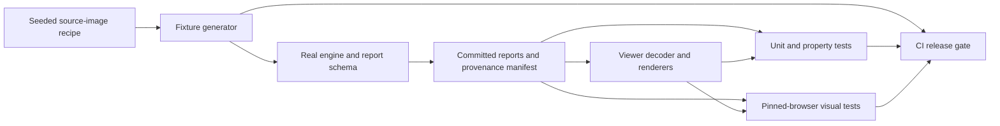
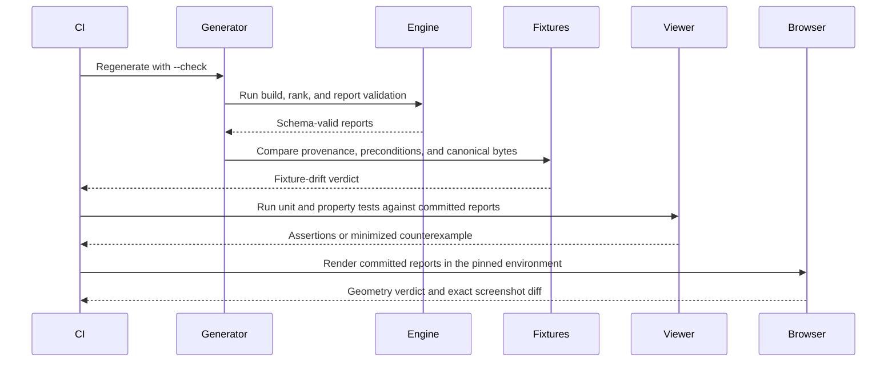

# ADR-0010: Frontend verification uses engine-generated fixtures and layered tests

- **Status:** Proposed
- **Date:** 2026-08-08
- **Extends:** ADR-0001, ADR-0002 (amended by [ADR-0008](0008-report-contract-for-viewer.md); this
  record's schema-compatibility tests track whichever report-contract record is authoritative for the
  implemented engine), ADR-0004, and [ADR-0007](0007-viewer-architecture.md), whose components this
  record's test layers exercise. Depends on [ADR-0009](0009-measurement-and-evaluation-contract.md) for
  the evaluation entry point and results envelope its `frontend-verification` measurable claim is
  registered under; see "Verification" below.
- **Measurable claim:** yes. A viewer conforming to this record preserves the report's
  statistical states under unit and property tests, and its pinned-browser screenshots have
  zero differing pixels from reviewed baselines. The repository-owned source corpus is named
  `frontend-verification`. This record remains `Proposed` until that row exists in
  [`DATASETS.md`](../../DATASETS.md) and the threshold registered below exists in
  [`eval/thresholds.json`](../../eval/thresholds.json), both before the first baseline run.

## Context

The browser viewer presents statistical output whose errors can look polished. A point marker
can cover its interval band. An abstention can fall through a numeric formatter and appear as
zero. A report from an unsupported schema can render enough familiar fields to look valid. A
carousel can contain three reference images in the document while showing only one at a time.
None of those failures is reliably found by looking at one screenshot without knowing the
report that produced it.

The engine already gives the frontend a strong boundary. A scored asset requires `score`,
`interval`, and `rank`, while an abstained asset carries `reason`, `explanation`, and
`measurement` and has no score attribute (`moodboard/report.py:221-277` and
`moodboard/schema/report_v1_0.schema.json:#/$defs/scoredAsset`,
`#/$defs/abstainedAsset`). The engine validates Draft 2020-12 JSON Schema and its cross-field
axis invariant immediately before it writes a report (`moodboard/report.py:723-782`). That
means the viewer can test against the actual producer contract instead of maintaining a
second, imagined producer.

Several boundaries still require frontend-specific verification. The interval schema bounds
`low` and `high` separately but does not express `low <= high`
(`moodboard/schema/report_v1_0.schema.json:#/$defs/interval`). The v1.0 schema closes unknown
fields and pins the literal version `1.0`
(`moodboard/schema/report_v1_0.schema.json:7-20`), while the consumer compatibility policy is
directional: a consumer supports the minors it names explicitly and refuses every version it
does not name, including a minor numerically later than every named one
(`docs/adr/0008-report-contract-for-viewer.md:289-308`). That policy replaces ADR-0002's
blanket ignore-unknown-minor rule (`docs/adr/0002-report-contract.md:211-214`), which this
record cited until the amendment landed. The Python validator enforces axis-key equality
as a second step because JSON Schema cannot express it (`moodboard/report.py:723-771`). A
browser consumer therefore needs a version gate, an exact typed path for each minor it names,
and semantic checks after schema validation.

The comparison view has a similarly important gap between shape and meaning. The engine's
default is three nearest exemplars, ordered by descending cosine similarity with a stable
tie-break (`moodboard/cli.py:497-519,1130-1133`), and each exemplar resolves to an inline
reference thumbnail (`moodboard/schema/report_v1_0.schema.json:#/$defs/exemplar`,
`#/$defs/referenceEntry`, `#/$defs/thumbnail`). The schema does not require three exemplar
entries (`moodboard/schema/report_v1_0.schema.json:#/$defs/scoredAsset/properties/exemplars`).
ADR-0001 nevertheless makes seeing all three reference images the reason the viewer exists
(`docs/adr/0001-engine-and-viewer-split.md:15-25,49-56`). The tests must cover the promised
three-image case and the deficient-report case separately.

The implemented `moodboard report --html` entry point verifies both the report contract and the
manifest-owned offline viewer, then atomically publishes one self-contained artifact.
This record extends ADR-0001, ADR-0002 (amended by ADR-0008, whose v1.1 fields the engine now
emits), ADR-0004, and ADR-0007, whose component
boundaries and toolchain this record's test layers exercise directly. It changes no score, interval,
abstention rule, or report field.

## Decision

### One fixture corpus produced by the real engine

Every committed frontend report fixture is an unedited output of the repository's real
`moodboard build` and `moodboard rank` paths. The fixture generator may create deterministic
source images and arrange scenarios, but it may not construct a `Report`, assemble a report
dictionary, copy a JSON example from an ADR, or patch the engine's JSON after it is written.
The generated document is passed through `moodboard report <path>` as a second validation
step. The current engine already routes `rank` through `write_report`, which validates in the
same call before writing (`moodboard/cli.py:900-952`; `moodboard/report.py:774-782`).

The corpus contains at least four engine-produced scenarios. One scenario contains scored
assets with distinct interval widths, at least one exact score tie, and exactly three
resolvable exemplars for the selected asset. Three further scenarios exercise `resolution`,
`multi_modality`, and `far_outlier` abstentions. Generation asserts these preconditions before
accepting an output, so a changed engine cannot quietly turn an abstention fixture into a
scored fixture or reduce a three-reference comparison to two. The abstention vocabulary is
the current closed set in
`moodboard/schema/report_v1_0.schema.json:#/$defs/abstainedAsset/properties/reason`.

The source images come from a repository-owned deterministic recipe with seed `20260808`.
They require no network and no downloaded checkpoint. This follows the existing engine-test
practice of synthesising images from a seeded generator and asserting that the generated
board still has the property the test names (`tests/test_cli.py:1-22,44-57,108-177`). The
source recipe creates visually distinct reference thumbnails so that a duplicate, reordered,
or hidden exemplar is visible in a diff as well as detectable in the document.

Handwritten complete report JSON is forbidden even for an error case. A unit or property
test that needs an invalid report starts from an engine-produced fixture, copies it in memory,
and applies one named mutation. Examples include reversing interval endpoints, removing a
required field, adding an unknown minor-version field, changing the major version, or
breaking an exemplar reference. Mutated documents are ephemeral counterexamples. They are
never committed as golden fixtures, and the test records the mutation beside the assertion.

### Fixture provenance and regeneration

The fixture directory contains the generated reports and one committed manifest. For every
report, the manifest records the scenario name, report SHA-256, schema version and schema-file
SHA-256, the exact `build`, `rank`, and validation argument vectors, the fixture seed, every
source-image SHA-256, the engine Git commit, a digest of the engine source tree, the
`uv.lock` SHA-256, the generator SHA-256, and the scenario preconditions observed in the
output. It also records the pinned browser build, operating-system image, bundled-font
digests, viewport configuration, device-pixel ratio, locale, time zone, and colour scheme
used for each visual baseline.

The report's own provenance remains authoritative for the engine name and version, model identity,
structured argument vector and rendered command, seed, creation time, schema identity, and any
resolved engine-source revision recorded by report v1.1. Candidate and reference content hashes
identify the report images. The sidecar remains necessary because report provenance deliberately
does not carry the dependency-lock digest, fixture-generator identity, browser identity, complete
fixture source-image manifest, or a mandatory engine-source tree digest.

The check command regenerates all source images and reports into a temporary directory, runs
the engine's validator, verifies the scenario preconditions, and compares the result with the
committed corpus. The comparison is byte-for-byte after replacing only
`board.built_at` and `provenance.created_at` with fixed sentinels. Those are the two wall-clock
values the current CLI supplies (`moodboard/cli.py:348-350,421,948`). The committed report
itself remains untouched and its full SHA-256 must match the manifest. Any other generated
difference is fixture drift.

Regeneration is a separate `--write` operation. It replaces reports and their manifest only
after every scenario precondition passes. Visual baselines are then regenerated from those
committed reports in the pinned browser. A change to a report, manifest, or screenshot is
reviewed as one set. CI never accepts or rewrites a baseline. Intermediate board files,
temporary reports, browser profiles, and passing traces are regenerated and are not
committed. On failure, actual screenshots, diff images, browser traces, and minimized property
counterexamples are retained as CI artifacts.

### Responsibilities of the three test layers

**Unit tests own deterministic meaning.** They test report-version dispatch, supported-major
projection, semantic validation, state discrimination, number formatting, accessible text,
exemplar resolution and order, and the DOM structure produced by one component. They assert
the exact fields read from a report and the exact error selected for an invalid one. They do
not decide whether a browser laid those elements out visibly.

**Property tests own invariants over many boundary values and mutations.** They generate
finite interval endpoints, supported-minor additions, asset-state mixtures, axis vocabularies,
and exemplar reference graphs around the engine-produced seeds. They assert invariants rather
than snapshot strings. The generator is deterministic, prints its seed and minimized failing
input, and writes that counterexample as a failure artifact. A discovered minimum case is
added later as an explicit unit regression while the property remains in place.

**Visual-regression tests own browser layout and visual hierarchy.** They use the committed
engine fixtures in the pinned browser to verify that the interval band is visible beside its
point marker, an abstention is visually dominant over unavailable numeric regions, error
states do not expose partial statistical content, and all three exemplar images are visible
together. Before taking a screenshot, the browser test also asserts nonzero bounding boxes,
viewport intersection, and lack of pairwise occlusion for the three images. A screenshot
alone cannot distinguish a hidden element from an absent one, so those geometry assertions
are part of the visual test.

No layer may waive another. A matching screenshot does not excuse a semantic failure, a unit
pass does not excuse a layout change, and a property pass does not establish that the three
images are visible at the same time.

### Required assertions and breaking inputs

**Intervals.** For every scored asset, unit tests assert a separately labelled point p-value,
both interval endpoints, the interval level, and the method name in accessible text. The
visual band and point marker have separate elements, and neither is labelled as an on-brand
percentage, approval probability, or confidence in a human judgment, which are forbidden
score interpretations (`eval/thresholds.json:89-113`). Property tests cover all finite
`0 <= low <= high <= 1` endpoints, including zero-width and full-width intervals, and assert
that the coordinate mapping is monotone and remains inside the plot. A nonzero interval whose
formatted endpoints would otherwise be equal must increase displayed precision or state that
the interval is narrower than the displayed precision. The breaking inputs are a narrow
interval such as `[0.0501, 0.0504]`, the full interval `[0, 1]`, a zero-width interval, a
reversed interval, an endpoint outside `[0, 1]`, and a missing `level` or `method`. Reversed,
non-finite, out-of-range, and incomplete intervals produce a report error with no partial
chart.

**Abstentions.** Unit tests assert that dispatch occurs on `state` before any numeric field is
read. Each of the three real-engine abstention fixtures displays its reason, full explanation,
and trigger measurement; has no point score, interval, or rank; describes `axes.style: null`
as unavailable; and retains any reported classical-axis values. The renderer must not coerce
an absent score or null style value to zero. Property mutations add a poison `score`, `rank`,
or `interval` to an abstained object, remove its explanation, substitute an unknown reason,
or change `axes.style` from null to a number. Each mutation must be rejected before rendering.
These inputs catch a union parser that merges the two branches or a component that reuses the
scored template for a refusal.

**Schema compatibility.** The loader reads and validates `schema_version` before assets. A
`1.0` fixture is checked against all known required fields and semantic invariants. An
in-memory `1.1` mutation must produce an `unsupported_schema_version` refusal and render no
board, assets, axes, or images for as long as `1.1` is absent from the consumer's
`supported_minor_versions`, because compatibility is directional rather than additive
(`docs/adr/0008-report-contract-for-viewer.md:289-308`). When an accepted report contract adds
`1.1` to that list, this case inverts: the mutation must then render every field the contract
names, and a field the contract requires but the viewer drops is a failure rather than a
tolerated unknown. An in-memory `2.0` mutation must produce an unsupported-version error and
render no board, assets, axes, or images. A `1.0` mutation that removes a required field,
violates the axis-key equality, or leaves an exemplar id unresolved must also fail without
partial statistical output. These cases catch a decoder that tolerates an unnamed minor and so
revives the replaced blanket policy, a decoder that drops fields of a minor it does name, and
a permissive parser that reads an unsupported major version.

**Simultaneous reference-image display.** The selected scored fixture carries three exemplar
ids whose inline thumbnails are deliberately different. Unit tests assert that the three ids
resolve, retain report order, and create three labelled image elements. Browser tests assert
that all three images have loaded, have nonzero and pairwise non-occluded rectangles inside
the comparison viewport, and are visible without a click, hover, tab change, carousel step,
or network request. A layout may wrap the images only if all three remain visible together in
the supported comparison viewport. The breaking inputs are three ids reordered by a renderer,
one duplicated id, one unresolved id, only two exemplar entries, and CSS that leaves three
nodes in the DOM while hiding or stacking two. A report with fewer than three resolvable
exemplars gets an explicit insufficient-reference-comparison state. The viewer never invents
or duplicates an image to fill the gap.

### Enumerated regression matrix

The four areas above carry the highest risk and are stated as prose because their failure modes need
explaining. The matrix below is the complete enumeration, and it is the list a reader checks a run
against. It moved here from ADR-0007, which decides the viewer's architecture and rendering
invariants but owns no fixture corpus, no dataset row, and so has no place to say what a passing run
means. Every row draws on the one corpus and the one generator fixed above, and no row introduces a
fixture of its own.

| Test | Assertion | Breaking input that must catch a regression |
|---|---|---|
| `dependency-boundaries` | A static import check finds exactly the eleven diagrammed dependencies, with source adapters and model code free of React and presenters unable to import raw report JSON. | Add test-only modules in which a source imports React and a presenter imports the JSON decoder. The boundary check must name both forbidden edges. |
| `known-field-routing` | Every leaf in the known-v1 projection has exactly one typed visible, selected-image, or validation-only route. Only an unselected thumbnail payload may take the validation-only route. A fixture with distinct valid values exposes every visible destination in the semantic DOM, including board statistics, comparison note, complete reference metadata, flags, and provenance. | Remove the provenance model hash route, mark a non-thumbnail field validation-only, and separately render thumbnail base64 as text. Each mutation must fail with the exact schema pointer. |
| `consumer-contract-shape` | The projection document passes its closed schema; every pointer resolves; every writer field is covered once; both generated language types match; every rule identifier is present; `supported_minor_versions` always contains `"1.0"`; and a non-null strict version is a member of `supported_minor_versions` and matches the accepted report-contract ADR. | Remove one projection node, add an unknown rule, break a pointer, remove `"1.0"` from `supported_minor_versions`, and set a strict version absent from `supported_minor_versions` in independent copies. Initialization must fail. A null strict version must produce `dependency-unresolved` and prevent a release build. |
| `source-read-failures` | A rejected local `File.arrayBuffer()` call and a missing, duplicate, or malformed embedded payload enter `failed` with code `source-read` at `$source`. The decoder and thumbnail probe are not called, and no prior report remains visible. | Inject the local rejection, then remove the payload element, duplicate it, and replace its text with invalid base64 in separate standalone copies. Any untyped rejection, decoder call, partial report, or wrong issue path is a failure. |
| `load-source-equivalence` | The local-file and embedded adapters produce the same immutable model, visible text, exemplar slots, and diagnostics for the same report bytes. | Corrupt one character of the embedded base64 payload. The standalone path must enter `failed` and must not mount a partial report. |
| `json-syntax-failure` | Both consumers report code `json-syntax` at `$bytes`, preserve the origin label, and render no report values. The Python path preserves a sentinel destination. | Delete the final closing brace from engine-written bytes while retaining valid UTF-8. Any schema error, uncaught parser exception, or written HTML is a failure. |
| `strict-utf8` | Local-file, embedded, and Python-inliner paths decode UTF-8 without replacement and report code `utf8` at `$bytes`. | Insert bytes `C3 28` into an engine report, base64-encode those same bytes for the embedded case, and seed the Python destination with sentinel bytes. All three paths must fail, no U+FFFD may render, and the sentinel must remain unchanged. |
| `binary64-number-fidelity` | Both consumers preserve number lexemes until every accepted token has a finite binary64 value whose shortest decimal representation has the same exact decimal value. | Set `score` and `axes.style` to `0.100000000000000005`, and separately place `1e10000` in an abstention measurement. Local, embedded, and Python paths must report `numeric-range` at the mutated path instead of rendering a rounded or infinite value. |
| `safe-json-integer` | Both consumers reject every integer-valued token outside plus or minus `9007199254740991` with code `numeric-range` and its JSON path. | Set a scored asset's rank to `9007199254740992` without changing any other field. Local, embedded, and Python paths must report the same failure instead of rendering a rounded rank. |
| `second-load-resets-state` | Starting report B invalidates report A's request identifier, removes A while loading, and resets selection, hover, focus, and filtering. Successful B publishes only B; failed B shows only B's origin and issues. No index, tie, asset, diagnostic, or delayed completion from A remains. | Hold A's thumbnail probe pending, start and complete B with one identical `asset_id` but different values, then resolve A. Repeat with B failing. Any display or restoration of A, transition away from B, or stale score, reference, focus, tie, or diagnostic is a failure. |
| `thumbnail-preflight-ownership` | `LoadingView` remains visible, with no report values, until every safe selected thumbnail probe settles. On legacy input, a rejected image is an immutable diagnostic and labelled slot on the first `ready` render; probe-mechanism failure enters `failed` with no partial model. | Include unresolved, invalid-base64, and unsupported-MIME exemplars beside one delayed safe source and one rejected safe source. Probing any unsafe case, an early or invisible loading state, a diagnostic added after `ready`, or a partially rendered fatal case is a failure. |
| `thumbnail-post-ready-fallback` | If an image element fails after its source passed preflight, only that cell switches to the exact labelled fallback while identifier, position label, similarity, and immutable model diagnostics remain unchanged. | Dispatch an `error` event on one rendered preflighted image. A blank image, changed shared diagnostic, or affected sibling cell is a failure. |
| `version-policy-in-both-modes` | The production consumer contract names exactly `1.0` and `1.1`. Each version passes its own exact schema and typed decoder through local-file loading and `moodboard report REPORT_JSON --html OUTPUT_HTML`; v1.0 remains visibly legacy and is never relabelled. Reports `1.2`, `2.0`, malformed, or missing a version are refused before asset content is interpreted. Unknown structural fields in either named version fail its closed schema rather than being projected away. | Give an unknown-version report a malformed first score and require `unsupported_schema_version`, not a score error or partial output. Add one unknown root field to v1.1 and require schema refusal. Any projection, relabelling, rendered value, or written HTML output for either mutation is a failure. |
| `minor-axis-extension-is-versioned` | Report v1.1 accepts only the defined style/palette/tone/composition definitions and exact matching asset key sets. A new `texture` axis requires a later named report minor with its own method definition; it cannot be smuggled into v1.1's open scalar map. | Add `texture` to `board.representation.axes`, every asset's axes, and `axis_definitions` without changing `schema_version`. Both loading modes must refuse the v1.1 document rather than render or silently omit texture. |
| `branch-exhaustiveness` | A scored asset renders its score, interval, and rank. An abstained asset renders its reason, explanation, and measurement with no numeric score region. | Add `score: 0`, `interval`, or `rank` to an abstained asset, and separately remove `interval` from a scored asset. Every mutated report must fail decoding. |
| `identity-integrity` | Asset and reference indexes contain unique identifiers, and each asset contains unique exemplar identifiers. | Duplicate an `asset_id`, duplicate a `reference_id`, and repeat one exemplar identifier within an asset in three independent mutations. Each must fail with the duplicate's JSON path. |
| `score-axis-equality` | Every scored asset has `score === axes.style`, while every abstained asset has `axes.style === null`. | Change only `axes.style` on a scored asset and change only `axes.style` from null on an abstained asset. Both reports must fail before rendering. |
| `tie-integrity` | Every tie has two distinct scored endpoints, and each unordered pair occurs once. | Add A-A, add a tie to an abstained asset, and add B-A beside A-B in independent mutations. Each report must fail with the offending tie path. |
| `tie-pairs-only` | The one report-level tie list renders each engine-provided pair once and never constructs a tie group. | Give A and C overlapping marginal intervals but list only A-B and B-C. The UI must show exactly A-B and B-C and no A-C relation or A-B-C group. |
| `interval-is-primary` | A scored fixture with `score: 0.31` and interval `[0.18, 0.42]` exposes the point, both endpoints, stated level, and method in visible and accessible text on a fixed `[0,1]` scale. | Replace the interval with `[0,1]`. The full-width band and both endpoint labels must remain. A point-only card, rescaled axis, probability phrase, or hidden interval is a failure. |
| `interval-precision` | Endpoints `0.1000001` and `0.1000002` remain different in visible text and the accessible name, and the raw interval level remains unchanged. | Apply fixed two-decimal formatting or derive a percentage in a mutation build. Identical endpoint labels, a changed level, or any new percentage must fail the exact-text assertion. |
| `zero-width-interval` | An interval with equal endpoints renders a visible endpoint rule, names both equal endpoints, and says "zero-width interval" in visible and accessible text. | Set `low`, `high`, `score`, and `axes.style` to `0.5`. A missing interval mark, point-only description, or failure of another cross-field invariant is a failure. |
| `interval-order` | Every decoded interval has `low <= high`, and the renderer never swaps endpoints or clamps them. | Mutate a valid interval to `low: 0.8, high: 0.2`. The whole report must enter `failed`. |
| `abstention-has-no-score-slot` | Each of the three reasons renders "No style score was issued," the full explanation, and all trigger-measurement entries. It has no rank, interval, point marker, zero, or empty score cell. | Use an engine-produced abstention whose classical palette value is `0`. The test must still find no style score, catching a selector that mistakes an axis zero for a style score. |
| `nested-abstention-measurement` | A schema-valid nested measurement renders one path-labelled, typed leaf for every value in deterministic order. It never emits `[object Object]`, a comma-joined array, or executable markup. | Replace an engine measurement with `{"z":null,"a":{"items":[true,{"n":0.1000001}],"empty":[]}}`, then revalidate it. The visible terms and values must be `/a/empty: []`, `/a/items/0: true`, `/a/items/1/n: 0.1000001`, and `/z: null` in that order. |
| `release-triptych-contract` | After ADR-0008 is accepted and supplies the exact strict version, that version and every later supported v1 minor require exactly `min(3, references.length)` distinct exemplars in non-increasing similarity order, each resolving to an allowlisted thumbnail accepted by Pillow and the pinned Chromium, Firefox, and WebKit image decoders. On a fixture with three or more references the viewer displays all three in serialized order and does no sorting; on a fixture with fewer than three references it displays exactly that many and never pads to three. | Create separate strict-version mutations with two exemplars on a board of at least three references, four exemplars, a duplicate, an unresolved identifier, increasing similarities, MIME `image/gif`, base64 text `A`, Pillow-rejected image bytes, and bytes rejected by each browser engine. Repeat one mutation under a later minor with more digits than the strict minor. Each path must fail before rendering; a null strict version must fail verification setup as `dependency-unresolved`. |
| `legacy-triptych-diagnostics` | A legacy v1.0 report with two, four, unresolved, invalid-base64, unsupported-MIME, or undecodable exemplar entries renders three visible reported-exemplar slots plus the exact applicable diagnostics. It never labels those slots closest, duplicates an image, fetches, or sorts. | Supply each malformed legacy case independently through both structural consumers and the browser, using base64 text `A` and MIME `image/gif` for those two cases. Missing a slot label or diagnostic, emitting a closest-reference claim, or showing a fetched substitute is a failure. |
| `triptych-viewports` | At 320 by 800 and 1280 by 800 pixels, all three triptych image boxes have nonzero bounds inside the viewport, their captions are visible, their horizontal order matches the report, and the document has no horizontal overflow. | Replace the three-column strip with a carousel breakpoint at 320 pixels. The missing second or third bounding box must fail the structural assertions. |
| `rank-order` | Scored assets follow report-provided rank, equal ranks use stable `asset_id` order, and abstained assets stay in the unranked section. | Serialize equal-score asset Z with rank 1 before equal-score asset A with rank 1, with an abstained asset between them. The ranked view must show A then Z, and the abstained asset must appear only in the unranked section. |
| `filter-preserves-report-facts` | Filtering changes visible asset cards only. It leaves model order, rank, tie pairs, and all active identifiers unchanged unless the user separately changes them. | Select a scored asset, apply the abstained filter, and remove the filter. Any changed rank, lost selection, rewritten tie, or reordered model is a failure. |
| `axis-separation` | Style, palette, tone, composition, and any report-declared later axis render as exactly one separately labelled row each, with no unlabeled or combined axis value. On abstention, `style: null` reads as unavailable while numeric classical axes remain visible. | Set style and score to `0.44`, palette to `0.11`, tone to `0.22`, and composition to `0.33` in a schema-valid scored fixture. The axis table must have exactly four named rows with those values and no fifth numeric row. |
| `axis-vocabulary-integrity` | Every asset's axis keys equal the union of `{"style"}` and `set(board.representation.axes)`. | Add an axis to one asset without adding it to `board.representation.axes`. Decoding must fail with the asset path. |
| `null-classical-axis` | Every null classical axis on an abstained asset renders its axis name followed by "Unavailable," while other numeric classical axes remain visible. | Change only `axes.palette` on an engine-produced abstention to null and revalidate it. Rendering zero, an empty cell, or omitting Palette is a failure. |
| `text-is-data` | Board names, asset identifiers, sources, explanations, flags, and provenance strings render as text and create no elements, links, styles, or code. | Put `</script><script>globalThis.pwned=true</script>` in every free-text field before standalone inlining. The output must show literal text, leave `globalThis.pwned` absent, and create no executable element beyond the manifest-owned application script. |
| `hover-focus-priority` | Keyboard focus and pointer hover produce equivalent highlighting in the active scored asset's overview row, card, triptych, and outcome heading without changing selection. With focus on A, hover on B makes B active; pointer leave restores A; blur then restores the selected asset. An active abstained asset gains no numeric overview row. | Dispatch pointer leave by clearing both hover and focus in a mutation reducer. The failure to restore A, a changed value or position, or an invented abstained overview mark must fail the reducer and browser assertions. |
| `empty-report` | A schema-valid report with `assets: []` renders an explicit empty state, board details, and provenance with no score overview or asset card. The schema permits an empty array at `moodboard/schema/report_v1_0.schema.json:#/properties/assets`. | Replace the empty-state branch with the normal collection. A blank page, invented score, or uncaught exception is a failure. |
| `standalone-closure` | After the generated HTML is moved by itself to an empty directory and opened from `file:`, the complete report, thumbnails, styles, and application code render with zero network requests. Every runtime `src` and `href` is a `data:` URL, and the built code has no dynamic import or CSS `url()`. | Add a relative chunk, external URL, source map reference, or CSS font URL in separate mutation builds. Packaging or the browser request log must fail. |
| `manifest-contract` | Node and Python reject unknown manifest fields, duplicate roles, unsafe paths, and hash changes. Node also rejects any missing staged entry. Python rejects missing standalone package data, a mismatch in either asset decoded from the template, and a missing or duplicate token before publishing HTML. | Apply each named manifest, static-entry, asset, package-data, or template mutation independently. Every applicable consumer must identify the field or artifact, and Python must write no new destination. |
| `atomic-standalone-write` | Successful inlining replaces the destination once. Every validation, manifest, template, encoding, and simulated write failure preserves a pre-existing destination byte-for-byte and leaves no sibling temporary file. | Seed the destination with sentinel bytes and inject a failure after the temporary file is complete but before replacement. Any changed sentinel or leftover temporary file is a failure. |
| `consumer-parity` | Every compatibility, schema-edge, and invalid report produces the same structural acceptance or rejection and the same ordered fatal and diagnostic code-path pairs in TypeScript and Python. Browser-only probe outcomes are recorded separately. Every Python rejection preserves a sentinel destination. | Disable one rule in either consumer and run the full fixture matrix. The first acceptance, severity, code, path, or order difference must fail and name the rule. |
| `toolchain-provisioning` | Host checks assert every exact runtime and package version before fixture generation or build. Playwright provisions Chromium `151.0.7922.34` revision `1234`, Firefox `153.0` revision `1538`, WebKit `26.5` revision `2336`, and FFmpeg revision `1011`. Each completed manifest contains the toolchain file's SHA-256. | Change the running Node patch version, any browser or FFmpeg revision, or one toolchain-file byte. Verification must fail before producing `build-a`, or fail the manifest hash if the file changes during a build. |
| `build-reproducibility` | Two isolated clean builds under the pinned toolchain produce byte-identical application assets, manifest, consumer contract, standalone template, staged Python package data, and raw canonical archives. | Add the wall-clock time or an absolute checkout path to one generated artifact, or change one archive timestamp, mode, owner, path order, compression setting, or JSON separator. The byte comparison must name the first differing artifact. |
| `distribution-identity` | The static archive, wheel, and source distribution name one viewer version and contain bytes matching one verified manifest. | Change one template byte after the Vite build. Package verification must fail on its hash, and the HTML command must preserve an existing output file. |

### Dependency shape



The diagram contains eight components and eleven direct dependencies, so
`kappa = 11 / (8 * 7) = 0.196`. As in ADR-0007's identical computation for its own component graph
(`docs/adr/0007-viewer-architecture.md:136-138`), this describes the proposed graph and establishes no
quality threshold; no record in this repository registers a numeric coupling target, and this one does
not invent one. Routine frontend tests
depend on committed fixtures rather than a live Python process. Only the fixture-drift job
couples CI to the engine. All four decided behavior surfaces, intervals, abstentions, schema
compatibility, and simultaneous images, have deterministic automated assertions, so the
testability ratio is `4 / 4 = 1.0`.

The verification sequence makes the two kinds of results explicit.



### Pre-registered visual threshold

The visual quality gate is registered here on 2026-08-08, before any frontend baseline is
generated:

```json
{
  "frontend_visual_regression": {
    "adr": "0010",
    "max_differing_pixels": 0
  }
}
```

This exact object must be copied unchanged into `eval/thresholds.json` before the first
baseline run. Zero is chosen because the environment is pinned down to the browser build,
operating-system image, fonts, viewport, device-pixel ratio, locale, time zone, colour scheme,
and animation state. A positive allowance could hide the loss of a narrow interval endpoint,
one abstention border, or one small occlusion behind an aggregate percentage. An intentional
visual change is handled by reviewing and replacing the baseline. It is not handled by
weakening the comparator after seeing the diff.

The seed, viewport dimensions, and property-test example budget are reproducibility settings,
not quality thresholds. They are committed in configuration and reported on failure, but a
suite passes only when every generated example and every committed baseline passes. There is
no passing fraction.

### CI failure classes and release consequences

**Fixture or provenance failure means the engine-viewer boundary changed or cannot be
reproduced.** A report differs outside the two declared timestamp paths, a source or toolchain
digest changed, a scenario precondition stopped holding, or a manifest no longer describes
its report. The coordinated engine and viewer release is blocked. The permitted resolution
is to fix the regression or deliberately regenerate the corpus and review the report and
manifest diff. Editing JSON or refreshing screenshots alone is not a resolution.

**Unit or compatibility failure means a deterministic report meaning is lost.** The decoder,
formatter, state branch, semantic validator, accessible description, or version policy no
longer satisfies its contract. The viewer and self-contained HTML release are blocked. An
engine release that introduces the triggering schema version is also blocked until a
compatible viewer exists or the release explicitly declares that viewer unsupported.

**Property failure means there is a concrete counterexample to an invariant.** The minimized
input and replay seed are part of the release record, even when all named examples remain green. The
viewer release is blocked until the counterexample is fixed or an accepted decision changes
the invariant. Re-running with a different seed, increasing retries, or discarding the
counterexample cannot turn this class into a pass.

**Visual-regression failure means either visible product output or the supposedly pinned
rendering environment changed.** The viewer and HTML release are blocked until the actual,
expected, and diff images are inspected. If the change is intended, the baseline update and
its fixture provenance are reviewed together. A headless engine release may proceed only when
the fixture and compatibility jobs pass and the engine change did not alter the viewer's
contract.

**Infrastructure failure means CI produced no verdict.** Examples include a browser launch
failure, missing font, corrupt artifact upload, or exhausted worker. It is neither a product
failure nor a pass. Releases requiring frontend verification remain blocked until the same
commit obtains a complete result. Baselines are never updated from an infrastructure-failed
run.

## Verification

Per [ADR-0009](0009-measurement-and-evaluation-contract.md), `frontend-verification` is a registered
measurement identifier and its canonical entry point is
`uv run --frozen moodboard-eval run frontend-verification`, writing
`results/frontend-verification/<run-id>/{run.json,raw/,summary.json,checksums.sha256}`.

**That wrapper is ASPIRATIONAL and is not yet this record's acceptance criterion.** The two npm
commands below are. The wrapper cannot be specified until the envelope mapping is decided, and
`OPEN_QUESTIONS.md` records it as open on two points that bear directly on this measurement:
ADR-0009's `run.json` names no Node version, npm lockfile digest, or pinned-browser revision field,
and its `raw/` boundary does not say whether Playwright screenshots, diff PNGs, and browser traces
are `raw/` data or fall in the separately-named category of regenerated artifacts that never serve
as proof. Screenshots are the entire basis for this record's zero-differing-pixel gate, so a
measurement whose primary data has no declared home in its envelope has a name for a reproducible
command rather than the command itself. When that mapping lands, this section states the wrapper as the
canonical entry point and the two npm commands become its implementation.

They are shown directly here because they are this record's acceptance criteria and ADR-0009 does
not redefine frontend-specific tooling.

Viewer source lives under `viewer/` with the npm-based toolchain [ADR-0007](0007-viewer-architecture.md)
pins (`viewer/verification-toolchain.json`, `package-lock.json`, Node, npm). This record's frontend
test suite is `npm --prefix viewer`, not a separate package manager or directory, so its commands and
artifacts stay inside the one viewer toolchain ADR-0007 owns.

**Command.** The reproducible check is the following pair of commands, run from the repository
root in the pinned Python and Node environments:

```sh
set -eu
uv python install 3.14.3
viewer/scripts/assert-toolchain.sh viewer/verification-toolchain.json --phase host
uv sync --frozen --python 3.14.3
uv run --frozen --python 3.14.3 python scripts/generate_frontend_fixtures.py \
  --seed 20260808 --check viewer/tests/fixtures
npm --prefix viewer ci
PLAYWRIGHT_BROWSERS_PATH=viewer/test-artifacts/browsers \
  npm --prefix viewer exec -- playwright install chromium
viewer/scripts/assert-toolchain.sh viewer/verification-toolchain.json --phase complete
PLAYWRIGHT_BROWSERS_PATH=viewer/test-artifacts/browsers \
  npm --prefix viewer run test:ci -- \
  --fixtures viewer/tests/fixtures \
  --out test-artifacts/verification
MOODBOARD_VIEWER_TEST_OUT=viewer/test-artifacts/verification/packaging \
  uv run --frozen --python 3.14.3 pytest tests/test_packaging.py -k viewer
```

This sequence is longer than the two commands this section used to carry, and the reason is the
matrix above. Rows such as `toolchain-provisioning`, `build-reproducibility`, `consumer-parity`,
`manifest-contract`, `atomic-standalone-write`, and `distribution-identity` are not exercised by a
fixture check and a browser test run. They need the pinned-toolchain assertions, two isolated
production builds, and the Python packaging path, so a record that enumerates them has to invoke
them. `npm --prefix viewer run test:ci` is the single frontend script and must run TypeScript
type-checking, decoder and reducer unit tests, component semantic tests, the dependency-boundary
check, two isolated production builds, and Playwright integration tests across both loading modes
and both fixed viewports. Unit tests inject controlled thumbnail probes; Playwright uses the
browser's real image decoder and asserts the pre-ready state transitions. The packaging test builds
a wheel and source distribution from the verified viewer manifest, exercises
`moodboard report REPORT_JSON --html OUTPUT_HTML` against every valid fixture including the v1.1
compatibility fixture, runs every compatibility and invalid case through both structural consumers,
and executes every named packaging failure. An invalid Python input is always tested over a
pre-existing sentinel destination.

Deliberate regeneration uses the same generator with `--write` instead of `--check`, followed
by `npm --prefix viewer run test:visual -- --update-snapshots`. These commands are
implementation acceptance criteria. Until they exist and run, this record remains `Proposed`.

**One generator, one corpus.** An earlier draft of this record specified a second fixture generator
alongside ADR-0007's, at the same seed, and left unifying them to `OPEN_QUESTIONS.md`. That is
decided here rather than deferred. There is exactly one frontend fixture generator,
`scripts/generate_frontend_fixtures.py`, and exactly one committed corpus, `viewer/tests/fixtures/`
with the provenance manifest described above. No second generator is created under `tests/`, and
ADR-0007 states no fixture regime of its own.

A regression case never needs a second corpus, which is what makes one generator sufficient. Every
case in the matrix below either uses a committed scenario as written or derives from one by the
single named mutation its row states, applied in memory. A derived document is an ephemeral
counterexample and is never committed. A verification run may materialise working copies, standalone
HTML, isolated build trees, and screenshots under `viewer/test-artifacts/`, which is ignored
(`.gitignore:49-57`); those are outputs of a run rather than fixtures, and nothing reads them as
a record of what the engine produces.

Two generators at one seed would have been the worst of the available arrangements. They agree for
exactly as long as nobody edits either one, and the first divergence surfaces as a frontend test
failure whose cause sits in a file the failing test never names.

**Sourced data.** The generator consumes the repository-owned deterministic image recipe,
seed `20260808`, the committed `eval/thresholds.json`, the current report schema, and the real
engine code and lockfile. The recipe derives from the offline seeded image construction already
used by `tests/test_cli.py:1-22,108-177`. It acquires no external data. The generator invokes
the public `build` and `rank` commands, including `--exemplars 3`, whose current command-line
contracts are at `moodboard/cli.py:1085-1148`.

**Artifacts.** The generator writes temporary source images, board files, and regenerated
reports during `--check`. The committed record is
`viewer/tests/fixtures/*.json`, its provenance manifest, and the reviewed screenshot
baselines. The frontend command writes a machine-readable summary and JUnit results under
`viewer/test-results/`. A failed visual case additionally writes expected, actual, and
diff PNGs plus a browser trace. A failed property writes the seed and minimized mutated report.

The build and packaging rows write more, and all of it under the ignored artifacts tree: isolated
build trees under `viewer/test-artifacts/build-a/` and `viewer/test-artifacts/build-b/`; Playwright
traces, captured request logs, DOM accessibility snapshots, dependency edges, byte-comparison results
and `verification.json` under `viewer/test-artifacts/verification/`; the pinned browser under
`viewer/test-artifacts/browsers/`; and canonical wheels, source distributions, static archives,
unpacked package-data inventories, sentinel destinations, and moved-alone HTML files under
`viewer/test-artifacts/verification/packaging/`. These are generated verification artifacts. None of
them is a fixture, and none becomes a report-contract source.

**Inspected pass-or-fail output.** A reader inspects
`viewer/test-results/summary.json` and the console summary. A pass states zero fixture
drift, all unit and property cases passed, every three-image geometry assertion passed, and
zero differing pixels for every baseline. A failure names exactly one of the CI classes above
and points to the changed report and manifest diff, the assertion and minimized input, or the
expected, actual, and diff images. A run with missing output is an infrastructure failure.

One gate precedes all of that and is a refusal rather than a failure. While `strict_triptych_since`
is null, meaning no accepted report-contract record has supplied the exact strict version, the
required result is a nonzero exit reporting `dependency-unresolved`, with no `build-a` produced and
no release artifact written. This is why ADR-0007 names ADR-0008 a release dependency: until that
version exists, the triptych rows cannot state what they are asserting, and a suite that passed
anyway would be certifying a contract nobody has written down. Once the version is supplied, a pass
additionally requires every row in the matrix to read `pass`; toolchain, type, dependency,
consumer-parity, both-build, and packaging checks to exit zero; every expected issue code, JSON path,
and visible string to be present; all triptych bounds to satisfy the fixed structural assertions;
every standalone request log to be empty; the two clean builds and raw canonical archives to be
byte-identical; the wheel and source distribution to contain the manifest-owned bytes; and every
failure case to preserve its sentinel destination. Any false entry, unexpected dependency or request,
missing artifact, unexpected ignored path, byte difference, uncaught console error, hidden interval
field, repeated tie, missing triptych cell, or partial HTML output is a failure. No percentage,
visual-difference tolerance beyond the pre-registered threshold above, allowed failure count, or
post-measurement cutoff exists in this record.

## Alternatives considered

**Handwritten JSON fixtures validated against JSON Schema.** Rejected. The current schema
cannot express the axis-key equality or interval endpoint ordering, and it permits fewer than
three exemplars. A hand-authored document can therefore be schema-valid while describing a
state the engine never emits. It also lets producer and consumer drift together because the
consumer's test data are maintained by the consumer.

**Generating every report inside every frontend test and committing no fixtures.** Rejected.
It would make routine Node tests depend on the Python environment and would leave no stable
report diff for review. The selected design keeps committed reports for fast frontend tests
and runs one dedicated regeneration check against the engine.

**Screenshot tests as the only frontend gate.** Rejected. A screenshot can remain identical
when accessible text, schema dispatch, hidden numeric values, or exemplar ids are wrong. It
also cannot explore enough interval endpoints and version mutations to establish an
invariant.

**Unit and property tests with no visual baselines.** Rejected. DOM nodes can be correct while
CSS hides an interval, stacks three images, or gives a score more visual weight than an
abstention. Those are browser layout failures and require checking in a real browser.

**A nonzero perceptual-difference allowance.** Rejected for the first implementation. It is
useful when the rendering environment cannot be made deterministic, but choosing it before
the environment is pinned guesses at which defects are safe to ignore. Choosing it after a
failure moves the bar to the result. Exact per-environment baselines preserve a reviewable
decision for every visible change.

## Consequences

Frontend tests exercise the same discriminated union, provenance, axis vocabulary, inline
thumbnails, and interval fields that the engine actually emits. A schema-moving engine change
therefore has one visible regeneration point instead of several unrelated mocks.

Failures become diagnostic. Unit failures identify meaning, property failures provide a
minimized boundary case, visual failures provide pixels and geometry, and fixture failures
identify producer drift. Reviewers do not have to infer which kind of information a red CI job
represents.

The cost is two toolchains plus a pinned browser image in CI. Fixture generation runs the real
engine several times, visual baselines require deliberate review, and browser and font
upgrades cause expected baseline churn. The exact-pixel rule will expose environment leaks
that a percentage tolerance would conceal, so maintaining hermetic rendering is ongoing work.

The fixture corpus is small and synthetic. Passing it proves rendering and compatibility
properties for the declared contract. It does not prove interval calibration, abstention
accuracy on natural images, content invariance, or general usability. Those claims remain
with the engine's pre-registered evaluation rows and user research.

The real-engine rule makes legitimate report changes more expensive because fixture reports,
their manifest, and affected screenshots move together. That cost is accepted because the
report file is the only integration boundary. A cheap fixture update that bypasses the engine
would remove the assurance this record exists to provide.

## Invalidation conditions

This decision should be superseded if the engine and viewer no longer communicate through a
versioned report file, or if the viewer begins computing scores, intervals, ranks, or
exemplars. Either change removes the single producer whose output makes these fixtures
authoritative.

It should also be revisited if an accepted report contract changes minor versions from
additive evolution to negotiated capabilities, or changes the promised simultaneous exemplar
count. The compatibility and three-image properties would then be testing obsolete meanings.

The zero-pixel threshold becomes wrong if repeated runs in the fully pinned environment
produce different pixels and the cause is an unavoidable renderer property rather than an
unpinned dependency. A replacement metric and threshold must be registered, with its false
acceptance analysis, before candidate baselines are measured. Existing failures cannot be
used to choose the new allowance.

Finally, this record should be amended if one of the required abstention scenarios cannot be
produced through the public engine after an accepted change to the statistical rules. The
scenario may change with that rule, but a handwritten report does not become acceptable as a
substitute.
